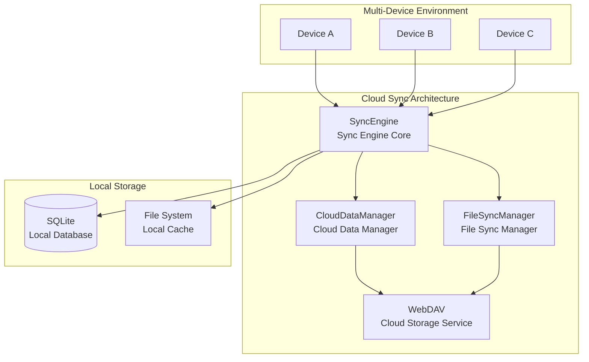

<a href="https://github.com/EcoPasteHub/EcoPaste">
  
</a>

<div align="center">
  <br/>
  
  <div>
      English | <a href="./README.md">简体中文</a> | <a href="./README.zh-TW.md">繁體中文</a> | <a href="./README.ja-JP.md">日本語</a>
  </div>

  <br/>
    
  <div>
    <a href="https://github.com/EcoPasteHub/EcoPaste/releases">
      
    </a >  
    <a href="https://github.com/EcoPasteHub/EcoPaste/releases">
      
    </a >
    <a href="https://github.com/EcoPasteHub/EcoPaste/releases">
      
    </a>
  </div>

  <div>
    <a href="./LICENSE">
      
    </a >
    <a href="https://github.com/EcoPasteHub/EcoPaste/releases">
      
    </a >
    <a href="https://github.com/EcoPasteHub/EcoPaste/releases">
        
    </a >
  </div>
  
  <br/>

  <picture>
    <source media="(prefers-color-scheme: dark)" srcset="./static/app-dark.en-US.png" />
    <source media="(prefers-color-scheme: light)" srcset="./static/app-light.en-US.png" />
    
 </picture>
</div>

## 🌟 Branch Information

> 📋 **This branch is based on the official EcoPaste v0.5.0 version, providing a temporary solution for cloud sync functionality as the official cloud sync feature has been delayed.**

### ✨ Current Features

- 🔄 **WebDAV Cloud Sync**: Multi-device clipboard data synchronization through WebDAV protocol
- 🗂️ **Dual-Switch Sync Mode**: Simple favorites mode and file mode switches for selective content synchronization
- 🔐 **Data Security**: Local-first storage architecture, data fully controlled, HTTPS/TLS encrypted transmission
- ⚡ **Real-time Sync Engine**: Smart conflict detection and resolution based on checksums, supporting bidirectional and incremental sync
- 🤖 **Background Auto Sync**: Rust plugin-based scheduled sync, configurable 1-24 hour intervals
- ⚙️ **Configuration Sync**: Complete application settings sync including sync modes, shortcuts, UI configurations
- 📁 **Optimized File Handling**: Smart file path extraction, metadata management, cross-device path consistency

### 📦 Usage Instructions

This branch is primarily for users who urgently need cross-device sync functionality, serving as a temporary solution until the official cloud sync feature is released. If you only need local clipboard management, we recommend using the [official main branch](https://github.com/EcoPasteHub/EcoPaste).

---

## 📥 Get Application

> 💡 **This branch focuses on cloud sync feature development. For downloading the complete application, please visit the official main branch.**

### 🔗 Visit Official Main Branch

- 🌐 **GitHub Homepage**: [EcoPasteHub/EcoPaste](https://github.com/EcoPasteHub/EcoPaste)
- 📱 **Official Downloads**: [Releases Page](https://github.com/EcoPasteHub/EcoPaste/releases)
- 📚 **Documentation**: [EcoPaste Official Website](https://ecopaste.cn/)

### 🛠️ Build from Source (Development Version)

```bash
# Clone this branch
git clone https://github.com/Ruszero01/EcoPaste-Sync.git

# Install dependencies
pnpm install

# Run in development mode
pnpm tauri dev

# Build production version
pnpm tauri build
```

> ⚠️ **Note**: This is a development branch and may contain experimental features. For production use, we recommend choosing the official stable version.

### ☁️ Cloud Sync Features (This Branch's Specialty)

#### 🏗️ System Architecture

Distributed cloud sync architecture based on WebDAV protocol, adopting a local-first design philosophy:



#### ✨ Core Features

- **Dual-Switch Sync Mode**: Simple favorites mode and file mode switches for flexible content control
- **Multi-type Support**: Support for various data types including text, images, and files
- **Bidirectional Sync**: Support for bidirectional data synchronization and incremental updates across multiple devices
- **Auto Sync**: Configurable sync intervals for automatic data synchronization
- **WebDAV Protocol**: Based on standard WebDAV protocol, compatible with various cloud storage services
- **Data Security**: Support for data encryption and compression to ensure secure transmission
- **Error Handling**: Comprehensive error handling and retry mechanisms to ensure sync reliability
- **Simple Interface**: Clean user interface and status display for easy operation

#### 📋 Technical Architecture Details

**🔄 Sync Process**

1. **Data Collection**: Collect clipboard data from local database
2. **Smart Filtering**: Filter data based on dual-switch sync mode (favorites mode/file mode)
3. **Conflict Detection**: Detect real conflicts based on checksums and timestamps
4. **Conflict Resolution**: Support three strategies: local priority, remote priority, smart merge
5. **File Processing**: Separate processing of metadata and original files
6. **Cloud Sync**: Upload index and files to WebDAV server
7. **Local Update**: Apply cloud changes to local database

**💾 Storage Architecture**

- **Local Storage**: SQLite database + file system cache
- **Cloud Storage**: WebDAV server (sync-data.json + files/ directory)
- **Data Format**: Hybrid architecture of lightweight index + complete metadata

**🛡️ Security Guarantees**

- Local-first storage, data fully controllable
- HTTPS/TLS encrypted transmission
- Smart conflict resolution to avoid data loss
- Comprehensive error handling and recovery mechanisms

📖 **Detailed Architecture Documentation**: View [Cloud Sync Architecture Documentation](./docs/CLOUD_SYNC_ARCHITECTURE.md) and [Architecture Diagram](./docs/architecture-diagram.md) for technical implementation details.

### Cloud Sync Configuration (This Branch)

1. **Prepare WebDAV Service**: Ensure you have an available WebDAV service
2. **Configure Connection**: Configure server information in preferences' "Cloud Sync" section
3. **Start Syncing**: Select appropriate sync strategy and start synchronization

## Star History

<a href="https://star-history.com/#EcoPasteHub/EcoPaste&Date">
 <picture>
   <source media="(prefers-color-scheme: dark)" srcset="https://api.star-history.com/svg?repos=EcoPasteHub/EcoPaste&type=Date&theme=dark" />
   <source media="(prefers-color-scheme: light)" srcset="https://api.star-history.com/svg?repos=EcoPasteHub/EcoPaste&type=Date" />
   
 </picture>
</a>

## Contributors

Thank you to everyone who has contributed to EcoPaste! If you’d like to contribute, check out the [Contributing Guide](./.github/CONTRIBUTING/en-US.md).

<a href="https://github.com/EcoPasteHub/EcoPaste/graphs/contributors">
  
</a>
