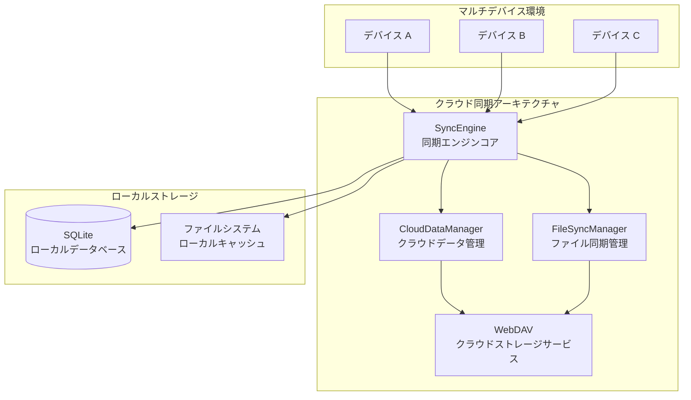

<a href="https://github.com/EcoPasteHub/EcoPaste">
  
</a>

<div align="center">
  <br/>

  <div>
      日本語 | <a href="./README.md">简体中文</a> | <a href="./README.zh-TW.md">繁體中文</a> | <a href="./README.en-US.md">English</a>
  </div>

  <br/>
    
  <div>
    <a href="https://github.com/EcoPasteHub/EcoPaste/releases">
      
    </a >  
    <a href="https://github.com/EcoPasteHub/EcoPaste/releases">
      
    </a >
    <a href="https://github.com/EcoPasteHub/EcoPaste/releases">
      
    </a>
  </div>

  <div>
    <a href="./LICENSE">
      
    </a >
    <a href="https://github.com/EcoPasteHub/EcoPaste/releases">
      
    </a >
    <a href="https://github.com/EcoPasteHub/EcoPaste/releases">
        
    </a >
  </div>

  <br/>

  <picture>
    <source media="(prefers-color-scheme: dark)" srcset="./static/app-dark.ja-JP.png" />
    <source media="(prefers-color-scheme: light)" srcset="./static/app-light.ja-JP.png" />
    
  </picture>
</div>

## 🌟 ブランチ情報

> 📋 **このブランチは公式 EcoPaste v0.5.0 バージョンをベースにし、公式のクラウド同期機能が遅れているため、クラウド同期機能の一時的なソリューションを提供します。**

### ✨ 現在の機能

- 🔄 **WebDAV クラウド同期**：WebDAV プロトコルを通じて複数デバイス間のクリップボードデータ同期を実現
- 🗂️ **デュアルスイッチ同期モード**：シンプルなお気に入りモードとファイルモードスイッチによる選択的コンテンツ同期
- 🔐 **データセキュリティ保障**：ローカルファーストストレージアーキテクチャ、データ完全制御、HTTPS/TLS 暗号化転送
- ⚡ **リアルタイム同期エンジン**：チェックサムベースのスマート競合検出と解決、双方向同期と増分更新
- 🤖 **バックグラウンド自動同期**：Rust プラグインベースのスケジュール同期、1-24 時間設定可能な間隔
- ⚙️ **設定同期**：完全なアプリケーション設定同期、同期モード、ショートカット、UI 設定を含む
- 📁 **ファイル最適化処理**：スマートファイルパス抽出、メタデータ管理、クロスデバイスパス一貫性保証

### 📦 使用説明

このブランチは主にクロスデバイス同期機能を緊急に必要とするユーザー向けで、公式のクラウド同期機能がリリースされるまでの一時的なソリューションとして提供されます。ローカルクリップボード管理機能のみが必要な場合は、[公式メインブランチ](https://github.com/EcoPasteHub/EcoPaste)の使用をお勧めします。

---

## 📥 アプリケーションの入手

> 💡 **このブランチはクラウド同期機能の開発に焦点を当てています。完全なアプリケーションのダウンロードについては、公式メインブランチをご覧ください。**

### 🔗 公式メインブランチへアクセス

- 🌐 **GitHub ホームページ**：[EcoPasteHub/EcoPaste](https://github.com/EcoPasteHub/EcoPaste)
- 📱 **公式ダウンロード**：[Releases ページ](https://github.com/EcoPasteHub/EcoPaste/releases)
- 📚 **ドキュメント**：[EcoPaste 公式サイト](https://ecopaste.cn/)

### 🛠️ ソースからビルド（開発版）

```bash
# このブランチをクローン
git clone https://github.com/Ruszero01/EcoPaste-Sync.git

# 依存関係をインストール
pnpm install

# 開発モードで実行
pnpm tauri dev

# 本番バージョンをビルド
pnpm tauri build
```

> ⚠️ **注意**：これは開発ブランチであり、実験的な機能が含まれている可能性があります。本番環境での使用は、公式の安定バージョンを選択することをお勧めします。

## 機能紹介

- 🎉 Tauri v2 をもとに開発、軽量で効率的、クロスプラットフォームの体験をさらに向上させる。
- 💻 Windows、macOS、Linux（x11）とも対応でき、複数デバイス間でシームレスに切り替え可能である。
- ✨ シンプルで直感的なユーザーインターフェース、敷居が低く簡単に利用可能になる。
- 📋 テキスト、リッチテキスト、HTML、画像、ファイル形式のクリップボード内容をサポートできる。
- 🔒 データはローカルに保存され、ユーザーのプライバシーを保護、データはユーザー自身が完全に管理できる。
- 📝 メモ機能をサポートでき、簡単に分類、管理、検索が可能で作業効率を向上させる。
- ☁️ **クラウド同期機能**：WebDAV プロトコルをベースにした多デバイス間のクリップボードデータ同期

#### 🏗️ システムアーキテクチャ

WebDAV プロトコルに基づく分散型クラウド同期アーキテクチャ、ローカルファーストの設計哲学を採用：



#### ✨ コア機能

- 🔄 **デュアルスイッチ同期モード**：シンプルなお気に入りモードとファイルモードスイッチで柔軟なコンテンツ制御
- 📊 **多種データタイプ対応**：テキスト、画像、ファイルなど多様なデータタイプの同期をサポート
- 🔄 **双方向同期**：多デバイス間の双方向データ同期と増分更新をサポート
- ⏰ **自動同期**：同期間隔を設定可能で、データを自動的に同期
- 🔐 **データセキュリティ**：データの暗号化と圧縮をサポートし、転送の安全性を確保
- 🛠️ **エラーハンドリング**：完全なエラー処理と再試行メカニズムで同期の信頼性を確保
- 🎨 **シンプルなインターフェース**：シンプルなユーザーインターフェースと状態表示で操作が簡単

#### 📋 技術アーキテクチャ詳細

**🔄 同期プロセス**

1. **データ収集**：ローカルデータベースからクリップボードデータを収集
2. **スマートフィルタリング**：デュアルスイッチ同期モード（お気に入りモード/ファイルモード）に基づきデータをフィルタリング
3. **競合検出**：チェックサムとタイムスタンプに基づき真の競合を検出
4. **競合解決**：ローカル優先、リモート優先、スマートマージの 3 つの戦略をサポート
5. **ファイル処理**：メタデータとオリジナルファイルの分離処理
6. **クラウド同期**：インデックスとファイルを WebDAV サーバーにアップロード
7. **ローカル更新**：クラウドの変更をローカルデータベースに適用

**💾 ストレージアーキテクチャ**

- **ローカルストレージ**：SQLite データベース + ファイルシステムキャッシュ
- **クラウドストレージ**：WebDAV サーバー（sync-data.json + files/ ディレクトリ）
- **データフォーマット**：軽量インデックス + 完全メタデータのハイブリッドアーキテクチャ

**🛡️ セキュリティ保証**

- ローカルファーストストレージ、データ完全制御可能
- HTTPS/TLS 暗号化通信
- スマート競合解決、データ損失を防止
- 完全なエラー処理と復旧メカニズム

📖 **詳細なアーキテクチャドキュメント**：技術実装の詳細については、[クラウド同期アーキテクチャドキュメント](./docs/CLOUD_SYNC_ARCHITECTURE.md)と[アーキテクチャ図](./docs/architecture-diagram.md)をご覧ください。

- ⚙️ 豊富なカスタマイズ設定で、異なるユーザーのニーズを満たす個別体験を提供できる。
- 🤝 完善なドキュメントとコミュニティ機能をサポート、開発者と共に成長を目指す。
- 🧩 継続的な最適化し、もっと驚きの機能があなたの発見を待っている。

## 履歴スター

<a href="https://star-history.com/#EcoPasteHub/EcoPaste&Date">
 <picture>
   <source media="(prefers-color-scheme: dark)" srcset="https://api.star-history.com/svg?repos=EcoPasteHub/EcoPaste&type=Date&theme=dark" />
   <source media="(prefers-color-scheme: light)" srcset="https://api.star-history.com/svg?repos=EcoPasteHub/EcoPaste&type=Date" />
   
 </picture>
</a>

## 貢献者

EcoPaste へ貴重なご貢献をいただいた皆様に感謝します！もし EcoPaste にご協力のご希望があれば、[貢献ガイド](./.github/CONTRIBUTING/ja-JP.md)をご覧ください。

<a href="https://github.com/EcoPasteHub/EcoPaste/graphs/contributors">
  
</a>
