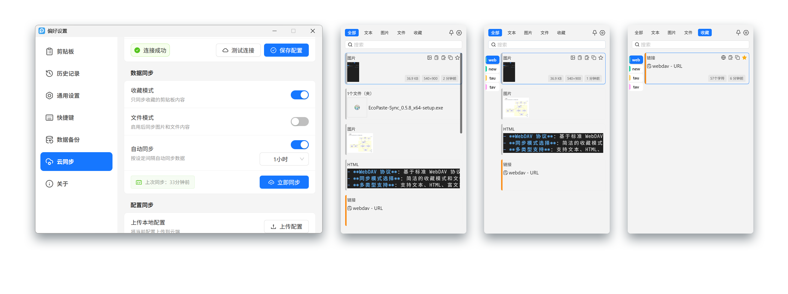
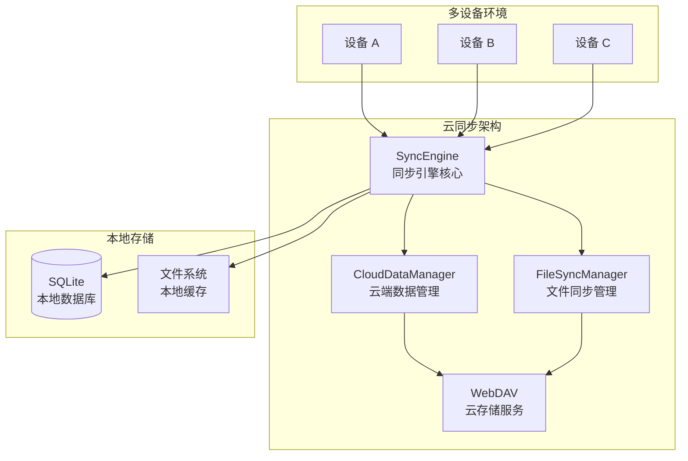

#

[%20%E7%9A%84%E5%BC%80%E6%BA%90%E5%89%AA%E8%B4%B4%E6%9D%BF%E7%AE%A1%E7%90%86%E5%B7%A5%E5%85%B7%E3%80%82&font=Source%20Code%20Pro&forks=1&issues=1&logo=https%3A%2F%2Fgithub.com%2FEcoPasteHub%2FEcoPaste%2Fblob%2Fmaster%2Fpublic%2Flogo.png%3Fraw%3Dtrue&name=1&owner=1&pattern=Floating%20Cogs&pulls=1&stargazers=1&theme=Auto)](https://github.com/EcoPasteHub/EcoPaste)

简体中文 | [繁體中文](./README.zh-TW.md) | [English](./README.en-US.md) | [日本語](./README.ja-JP.md)

[](https://github.com/EcoPasteHub/EcoPaste/releases)
[](https://github.com/EcoPasteHub/EcoPaste/releases)
[](https://github.com/EcoPasteHub/EcoPaste/releases)

[](./LICENSE)
[](https://github.com/EcoPasteHub/EcoPaste/releases)
[](https://github.com/EcoPasteHub/EcoPaste/releases)



## 🌟 分支说明

> 📋 **本分支基于官方 EcoPaste v0.5.0 版本，提供云同步功能的临时解决方案，由于官方云同步功能迟迟未上线 🥲。**

### ✨ 当前特性

- 🔄 **WebDAV 云同步**：通过 WebDAV 协议实现剪贴板数据的多设备同步
- 📚 **书签分组同步**：跨设备书签分组同步，支持自定义颜色、拖拽排序、中键删除、右键菜单管理
- 🗂️ **双开关同步模式**：简洁的收藏模式和文件模式开关，按内容类型和收藏状态进行选择性同步
- 🔐 **数据安全保障**：本地优先存储架构，数据完全可控，支持 HTTPS/TLS 加密传输
- ⚡ **实时同步引擎**：基于校验和的智能冲突检测与解决，支持双向同步和增量更新
- 🤖 **后台自动同步**：基于 Rust 后端插件的定时同步，支持 1-24 小时可配置间隔
- ⚙️ **配置同步**：完整的应用设置同步，包括同步模式、快捷键、界面配置等
- 📁 **文件优化处理**：智能文件路径提取、元数据管理、跨设备路径一致性保证

### 📦 使用说明

本分支主要面向急需跨设备同步功能的用户，作为官方云同步功能发布前的临时解决方案。如果您只需要本地剪贴板管理功能，建议使用 [官方主分支](https://github.com/EcoPasteHub/EcoPaste)。

---

## 📥 获取应用程序

> 💡 **本分支专注于云同步功能开发，如需下载完整应用程序，请访问官方主分支**

### 🔗 访问官方主分支

- 🌐 **GitHub 主页**：[EcoPasteHub/EcoPaste](https://github.com/EcoPasteHub/EcoPaste)
- 📱 **官方下载**：[Releases 页面](https://github.com/EcoPasteHub/EcoPaste/releases)
- 📚 **使用文档**：[EcoPaste 官网](https://ecopaste.cn/)

### 🛠️ 从源码构建（开发版）

```bash
# 克隆本分支
git clone https://github.com/Ruszero01/EcoPaste-Sync.git

# 安装依赖
pnpm install

# 开发模式运行
pnpm tauri dev

# 构建生产版本
pnpm tauri build
```

> ⚠️ **注意**：本分支为开发分支，可能包含实验性功能。生产使用建议选择官方稳定版本。

### ☁️ 云同步功能（本分支特色）

#### 🏗️ 系统架构

基于 WebDAV 协议的分布式云同步架构，采用本地优先的设计理念：



#### ✨ 核心特性

- **书签分组管理**：支持创建自定义书签分组，12种预设颜色可选，跨设备同步
- **书签操作**：右键菜单支持编辑、删除操作
- **双开关同步模式**：简洁的收藏模式和文件模式开关，灵活控制同步内容
- **多类型支持**：支持文本、HTML、富文本、图片、文件等多种数据类型同步
- **双向同步**：支持多设备间的双向数据同步和增量更新
- **后台自动同步**：基于 Rust 后端插件的定时同步，支持 1-24 小时可配置间隔
- **WebDAV 协议**：基于标准 WebDAV 协议，兼容 Nut、坚果云、NextCloud 等多种云存储服务
- **配置同步**：完整的应用设置同步，包括同步模式、快捷键、界面配置等
- **智能文件处理**：智能文件路径提取、元数据管理、跨设备路径一致性保证
- **数据安全**：本地优先存储，HTTPS/TLS 加密传输，智能冲突解决
- **错误处理**：完善的错误处理和重试机制，确保同步可靠性
- **简洁界面**：简洁的用户界面和实时状态显示，操作便捷

#### 📋 技术架构详情

##### 🔄 同步流程

1. **数据收集**：从本地 SQLite 数据库收集剪贴板数据
2. **智能筛选**：根据双开关同步模式（收藏模式/文件模式）和内容类型过滤数据
3. **冲突检测**：基于校验和的真实冲突检测，避免误报
4. **冲突解决**：支持本地优先、远程优先、智能合并三种策略
5. **文件处理**：分离处理元数据和原始文件，支持多种路径格式
6. **云端同步**：统一格式（CloudSyncData）上传到 WebDAV 服务器
7. **本地更新**：应用云端变更到本地数据库，刷新界面

##### 💾 存储架构

- **本地存储**：SQLite 数据库（剪贴板历史 + 同步状态）+ 文件系统缓存
- **云端存储**：WebDAV 服务器（sync-data.json 统一索引 + files/ 原始文件）
- **数据格式**：统一 CloudSyncData 格式，完整元数据和文件分离存储
- **配置存储**：store-config.json 独立配置同步文件

##### 🛡️ 安全保障

- 本地优先存储架构，数据完全可控
- HTTPS/TLS 加密传输，Base64 认证
- 智能冲突解决，避免数据丢失
- 完善的错误处理和恢复机制
- 设备标识和校验和验证

##### 🤖 后端自动化

- Rust 插件实现后台定时同步（eco-auto-sync）
- 线程安全的全局状态管理
- 可配置同步间隔（1、2、6、12、24 小时）
- 事件驱动的同步触发机制

📖 **详细架构文档**：查看 [云同步架构文档](./docs/CLOUD_SYNC_ARCHITECTURE.md) 和 [架构图](./docs/architecture-diagram.md) 了解技术实现细节。

### 云同步配置（本分支）

1. **准备 WebDAV 服务**：确保你有可用的 WebDAV 服务
2. **配置连接**：在偏好设置的"云同步"中配置服务器信息
3. **开始同步**：选择合适的同步策略并开始同步

## 历史星标

[](https://star-history.com/#EcoPasteHub/EcoPaste&Date)

## 贡献者

感谢大家为 EcoPaste 做出的宝贵贡献！如果你也希望为 EcoPaste 做出贡献，请查阅[贡献指南](./.github/CONTRIBUTING/zh-CN.md)。

[](https://github.com/EcoPasteHub/EcoPaste/graphs/contributors)
