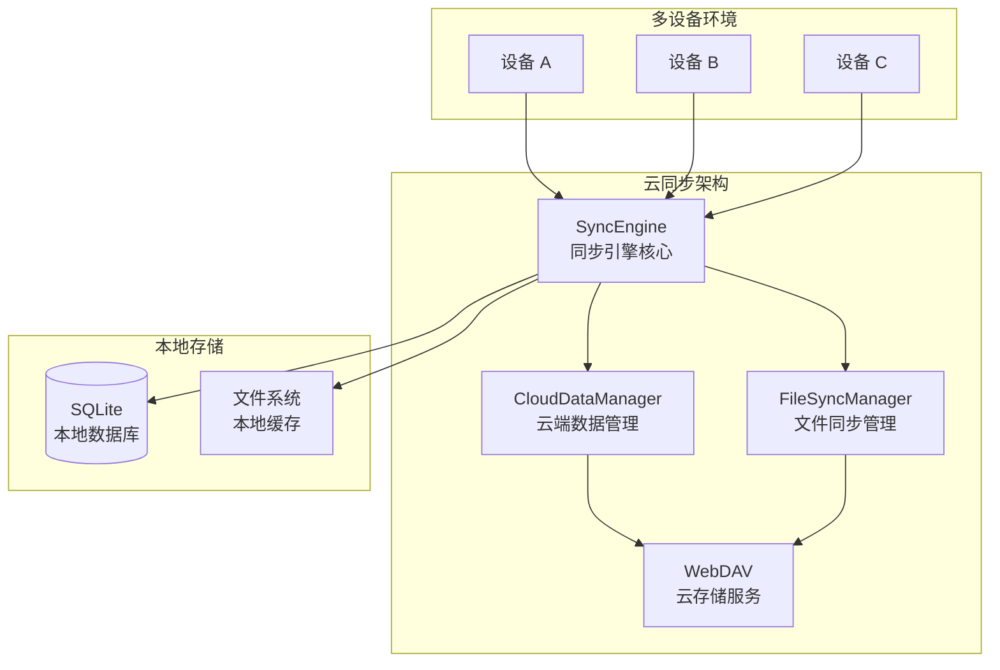

#

<picture>
  <source media="(prefers-color-scheme: dark)" srcset="./static/sync-dark.png">
  <source media="(prefers-color-scheme: light)" srcset="./static/sync-light.png">
  
</picture>

## 🌟 分支说明

> 📋 **本分支基于官方 EcoPaste v0.5.0 版本，提供云同步功能的临时解决方案，由于官方云同步功能迟迟未上线 🥲。**

---

## 📥 获取原版应用

### 🔗 访问官方主分支

- 🌐 **GitHub 主页**：[EcoPasteHub/EcoPaste](https://github.com/EcoPasteHub/EcoPaste)
- 📱 **官方下载**：[Releases 页面](https://github.com/EcoPasteHub/EcoPaste/releases)
- 📚 **使用文档**：[EcoPaste 官网](https://ecopaste.cn/)

### 🛠️ 从源码构建（开发版）

```bash
# 克隆本分支
git clone https://github.com/Ruszero01/EcoPaste-Sync.git

# 安装依赖
pnpm install

# 开发模式运行
pnpm tauri dev

# 构建生产版本
pnpm tauri build
```

> ⚠️ **注意**：本分支为开发分支，可能包含实验性功能。生产使用建议选择官方稳定版本。

### 本分支特性

#### ✨ 版本特性更新历史

##### v0.1.x

- **WebDAV 协议**：基于标准 WebDAV 协议，兼容多种 WebDAV 平台
- **同步模式选择**：简洁的收藏模式和文件模式开关，灵活控制同步内容
- **多类型支持**：支持文本、HTML、富文本、图片、文件等多种数据类型同步
- **双向同步**：支持多设备间的双向数据同步和增量更新
- **智能文件处理**：智能文件路径提取、元数据管理、跨设备路径一致性保证
- **优化窗口显示**：窗口跟随鼠标时不会超出屏幕外，支持多显示器

##### v0.2.x

- **后台自动同步**：基于 Rust 后端插件的定时同步，支持 1-24 小时可配置间隔

##### v0.3.x

- **配置同步**：完整的应用设置同步，包括同步模式、快捷键、界面配置等

##### v0.5.x

- **书签分组**：将搜索关键词作为书签，固定在侧边，支持与分组混合筛选
- **书签操作**：输入关键词添加书签，中键单击删除，支持拖拽排序，右键菜单编辑、删除
- **Mica 材质界面**：Windows11 平台下支持 Mica 云母材质
- **列表行高配置**：可高中低三档设置剪贴板列表行高
- **新增操作按钮**：新增「在资源管理器中显示」「在浏览器中打开」「预览图片」按钮
- **按钮智能显示**：操作按钮根据不同类型智能显示
- **优化信息显示**：统计信息移动到右下角避免与操作按钮冲突，只在聚焦时显示

##### v0.6.x

- **文本拖拽粘贴**：支持文本类型条目通过拖拽方式粘贴
- **文本编辑**：文本类型条目可编辑，支持纯文本富文本，支持语法高亮
- **链接分组**：新增链接分组，收集网络链接和本地、NAS 路径，支持一键跳转
- **代码识别**：新增代码分组，开启代码识别功能后自动识别剪贴板中的代码内容，支持语法高亮
- **来源应用**：新增显示来源应用功能，可通过偏好设置开启和关闭
- **多选操作**：Shift 连选，Ctrl 加选/减选，Ctrl+A 全选，支持批量收藏、删除、粘贴，批量拖拽粘贴
- **文本类型变更**：文本编辑器支持手动更改类型，添加 Markdown 编辑器支持，智能根据类型切换编辑器

##### v0.7.x

- **颜色识别**：新增颜色分组，开启颜色识别功能后识别剪贴板中的 RGB CMYK 向量，支持颜色选择器和色值互转

---

### 服务器配置

- **WebDAV 地址**：<你的服务器地址>/<子目录>
- **用户名**：WebDAV 用户名
- **密码**：WebDAV 密码
- **同步路径**：/<同步文件夹名称>

### 同步架构

基于 WebDAV 协议的分布式云同步架构，采用本地优先的设计理念：



📖 **详细架构文档**：查看 [云同步架构文档](./docs/CLOUD_SYNC_ARCHITECTURE.md) 和 [架构图](./docs/architecture-diagram.md) 了解技术实现细节。

## 贡献者

感谢大家为 EcoPaste 做出的宝贵贡献！

[](https://github.com/EcoPasteHub/EcoPaste/graphs/contributors)
