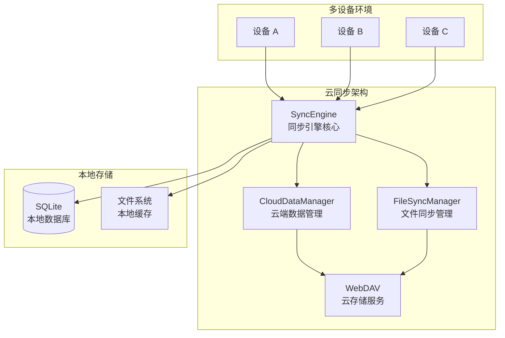

#


## 🌟 分支说明

> 📋 **本分支基于官方 EcoPaste v0.5.0 版本，提供云同步功能的临时解决方案，由于官方云同步功能迟迟未上线 🥲。**

---

## 📥 获取应用程序

> 💡 **本分支专注于云同步功能开发，如需下载完整应用程序，请访问官方主分支**

### 🔗 访问官方主分支

- 🌐 **GitHub 主页**：[EcoPasteHub/EcoPaste](https://github.com/EcoPasteHub/EcoPaste)
- 📱 **官方下载**：[Releases 页面](https://github.com/EcoPasteHub/EcoPaste/releases)
- 📚 **使用文档**：[EcoPaste 官网](https://ecopaste.cn/)

### 🛠️ 从源码构建（开发版）

```bash
# 克隆本分支
git clone https://github.com/Ruszero01/EcoPaste-Sync.git

# 安装依赖
pnpm install

# 开发模式运行
pnpm tauri dev

# 构建生产版本
pnpm tauri build
```

> ⚠️ **注意**：本分支为开发分支，可能包含实验性功能。生产使用建议选择官方稳定版本。

### 本分支特性

#### ✨ 版本特性更新历史

##### v0.1.x

- **WebDAV 协议**：基于标准 WebDAV 协议，兼容多种 WebDAV 平台
- **同步模式选择**：简洁的收藏模式和文件模式开关，灵活控制同步内容
- **多类型支持**：支持文本、HTML、富文本、图片、文件等多种数据类型同步
- **双向同步**：支持多设备间的双向数据同步和增量更新
- **智能文件处理**：智能文件路径提取、元数据管理、跨设备路径一致性保证
- **优化窗口显示**：窗口跟随鼠标时不会超出屏幕外，支持多显示器

##### v0.2.x

- **后台自动同步**：基于 Rust 后端插件的定时同步，支持 1-24 小时可配置间隔

##### v0.3.x

- **配置同步**：完整的应用设置同步，包括同步模式、快捷键、界面配置等

##### v0.5.x

- **书签分组**：将搜索关键词作为书签，固定在侧边，支持与分组混合筛选
- **书签操作**：输入关键词添加书签，中键单击删除，支持拖拽排序，右键菜单编辑、删除
- **Mica 材质界面**：Windows11 平台下支持 Mica 云母材质
- **列表行高配置**：可高中低三档设置剪贴板列表行高
- **新增操作按钮**：新增「在资源管理器中显示」「在浏览器中打开」「预览图片」按钮
- **按钮智能显示**：操作按钮根据不同类型智能显示
- **优化信息显示**：统计信息移动到右下角避免与操作按钮冲突，只在聚焦时显示

##### v0.6.x

- **文本拖拽粘贴**：支持文本类型条目通过拖拽方式粘贴
- **文本编辑**：文本类型条目可编辑，支持纯文本富文本，支持语法高亮
- **链接分组**：新增链接分组，收集网络链接和本地、NAS路径，支持一键跳转
- **代码识别**：新增代码分组，偏好设置中开启代码识别后自动识别剪贴板中的代码内容，支持语法高亮

#### 🏗️ 系统架构

基于 WebDAV 协议的分布式云同步架构，采用本地优先的设计理念：



#### 📋 技术架构详情

##### 🔄 同步流程

1. **数据收集**：从本地 SQLite 数据库收集剪贴板数据
2. **智能筛选**：根据双开关同步模式（收藏模式/文件模式）和内容类型过滤数据
3. **冲突检测**：基于校验和的真实冲突检测，避免误报
4. **冲突解决**：支持本地优先、远程优先、智能合并三种策略
5. **文件处理**：分离处理元数据和原始文件，支持多种路径格式
6. **云端同步**：统一格式（CloudSyncData）上传到 WebDAV 服务器
7. **本地更新**：应用云端变更到本地数据库，刷新界面

##### 💾 存储架构

- **本地存储**：SQLite 数据库（剪贴板历史 + 同步状态）+ 文件系统缓存
- **云端存储**：WebDAV 服务器（sync-data.json 统一索引 + files/ 原始文件）
- **数据格式**：统一 CloudSyncData 格式，完整元数据和文件分离存储
- **配置存储**：store-config.json 独立配置同步文件

##### 🤖 后端自动化

- Rust 插件实现后台定时同步（eco-auto-sync）
- 线程安全的全局状态管理
- 可配置同步间隔（1、2、6、12、24 小时）
- 事件驱动的同步触发机制

📖 **详细架构文档**：查看 [云同步架构文档](./docs/CLOUD_SYNC_ARCHITECTURE.md) 和 [架构图](./docs/architecture-diagram.md) 了解技术实现细节。

### 云同步配置（本分支）

1. **准备 WebDAV 服务**：确保你有可用的 WebDAV 服务
2. **配置连接**：在偏好设置的"云同步"中配置服务器信息
3. **开始同步**：选择合适的同步策略并开始同步

## 贡献者

感谢大家为 EcoPaste 做出的宝贵贡献！

[](https://github.com/EcoPasteHub/EcoPaste/graphs/contributors)
