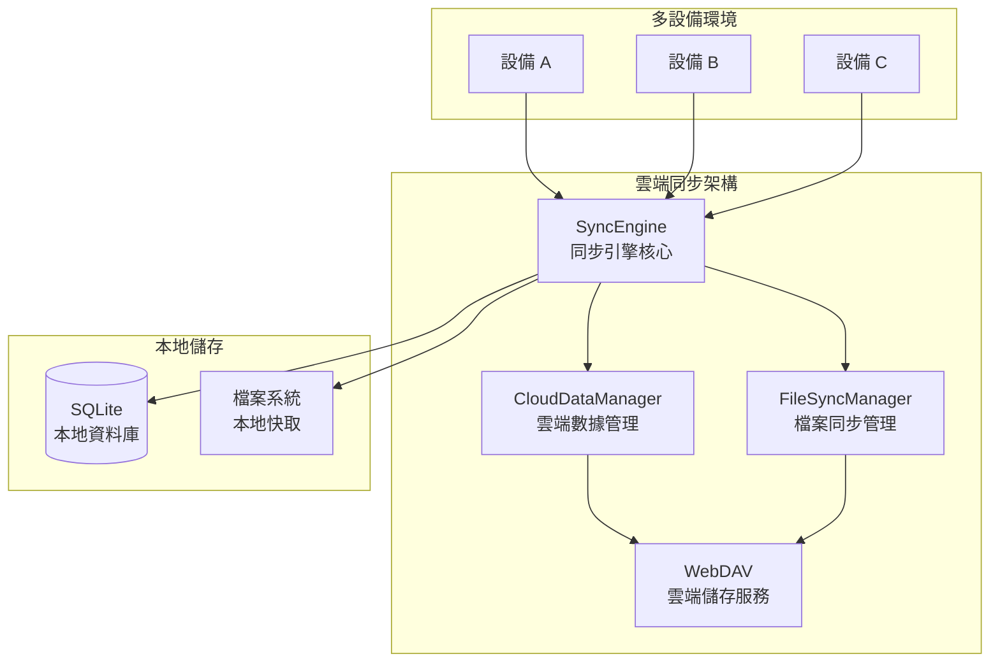

<a href="https://github.com/EcoPasteHub/EcoPaste">
  
</a>

<div align="center">
  <br/>

  <div>
    繁體中文 | <a href="./README.md">简体中文</a> | <a href="./README.en-US.md">English</a> | <a href="./README.ja-JP.md">日本語</a>
  </div>
  
  <br/>

  <div>
    <a href="https://github.com/EcoPasteHub/EcoPaste/releases">
      
    </a >  
    <a href="https://github.com/EcoPasteHub/EcoPaste/releases">
      
    </a >
    <a href="https://github.com/EcoPasteHub/EcoPaste/releases">
      
    </a>
  </div>

  <div>
    <a href="./LICENSE">
      
    </a >
    <a href="https://github.com/EcoPasteHub/EcoPaste/releases">
      
    </a >
    <a href="https://github.com/EcoPasteHub/EcoPaste/releases">
        
    </a >
  </div>

  <br/>

  <picture>
    <source media="(prefers-color-scheme: dark)" srcset="./static/app-dark.zh-TW.png" />
    <source media="(prefers-color-scheme: light)" srcset="./static/app-light.zh-TW.png" />
    
  </picture>
</div>

## 🌟 分支說明

> 📋 **本分支基於官方 EcoPaste v0.5.0 版本，提供雲端同步功能的臨時解決方案，由於官方雲端同步功能遲遲未上線。**

### ✨ 當前特性

- 🔄 **WebDAV 雲端同步**：透過 WebDAV 協定實現剪貼板數據的多設備同步
- 🗂️ **智慧同步模式**：支援輕量、完整、收藏三種同步模式，按內容類型和收藏狀態進行選擇性同步
- 🔐 **數據安全保障**：本地優先存儲架構，數據完全可控，支援 HTTPS/TLS 加密傳輸
- ⚡ **即時同步引擎**：基於校驗和的智慧衝突檢測與解決，支援雙向同步和增量更新
- 🤖 **背景自動同步**：基於 Rust 後端插件的定時同步，支援 1-24 小時可設定間隔
- ⚙️ **配置同步**：完整的應用設定同步，包括同步模式、快速鍵、界面配置等
- 📁 **檔案優化處理**：智慧檔案路徑擷取、元資料管理、跨設備路徑一致性保證

### 📦 使用說明

本分支主要面向急需跨設備同步功能的用戶，作為官方雲端同步功能發布前的臨時解決方案。如果您只需要本地剪貼板管理功能，建議使用 [官方主分支](https://github.com/EcoPasteHub/EcoPaste)。

---

## 📥 獲取應用程式

> 💡 **本分支專注於雲端同步功能開發，如需下載完整應用程式，請訪問官方主分支**

### 🔗 訪問官方主分支

- 🌐 **GitHub 主頁**：[EcoPasteHub/EcoPaste](https://github.com/EcoPasteHub/EcoPaste)
- 📱 **官方下載**：[Releases 頁面](https://github.com/EcoPasteHub/EcoPaste/releases)
- 📚 **使用文檔**：[EcoPaste 官網](https://ecopaste.cn/)

### 🛠️ 從源碼建構（開發版）

```bash
# 克隆本分支
git clone https://github.com/Ruszero01/EcoPaste-Sync.git

# 安裝依賴
pnpm install

# 開發模式運行
pnpm tauri dev

# 建構生產版本
pnpm tauri build
```

> ⚠️ **注意**：本分支為開發分支，可能包含實驗性功能。生產使用建議選擇官方穩定版本。

### ☁️ 雲端同步功能（本分支特色）

#### 🏗️ 系統架構

基於 WebDAV 協定的分散式雲端同步架構，採用本地優先的設計理念：



#### ✨ 核心特性

- **三種同步模式**：輕量級、完整、收藏同步，滿足不同需求
- **多類型支援**：支援文字、圖片、檔案等多種數據類型同步
- **雙向同步**：支援多設備間的雙向數據同步和增量更新
- **自動同步**：可設定同步間隔，自動同步數據
- **WebDAV 協定**：基於標準 WebDAV 協定，相容多種雲端儲存服務
- **數據安全**：支援數據加密和壓縮，確保傳輸安全
- **錯誤處理**：完善的錯誤處理和重試機制，確保同步可靠性
- **簡潔介面**：簡潔的用戶介面和狀態顯示，操作便捷

#### 📋 技術架構詳情

**🔄 同步流程**

1. **數據收集**：從本地資料庫收集剪貼簿數據
2. **智慧篩選**：根據同步模式過濾數據
3. **衝突檢測**：基於校驗和和時間戳檢測真實衝突
4. **衝突解決**：支援本地優先、遠端優先、智慧合併三種策略
5. **檔案處理**：分離處理元數據和原始檔案
6. **雲端同步**：上傳索引和檔案到 WebDAV 伺服器
7. **本地更新**：應用雲端變更到本地資料庫

**💾 儲存架構**

- **本地儲存**：SQLite 資料庫 + 檔案系統快取
- **雲端儲存**：WebDAV 伺服器（sync-data.json + files/ 目錄）
- **數據格式**：輕量級索引 + 完整元數據的混合架構

**🛡️ 安全保障**

- 本地優先儲存，數據完全可控
- HTTPS/TLS 加密傳輸
- 智慧衝突解決，避免數據遺失
- 完善的錯誤處理和恢復機制

📖 **詳細架構文檔**：查看 [雲端同步架構文檔](./docs/CLOUD_SYNC_ARCHITECTURE.md) 和 [架構圖](./docs/architecture-diagram.md) 了解技術實現細節。

### 雲端同步配置（本分支）

1. **準備 WebDAV 服務**：確保你有可用的 WebDAV 服務
2. **配置連接**：在偏好設定的"雲端同步"中配置伺服器資訊
3. **開始同步**：選擇合適的同步策略並開始同步

## 歷史星標

<a href="https://star-history.com/#EcoPasteHub/EcoPaste&Date">
 <picture>
   <source media="(prefers-color-scheme: dark)" srcset="https://api.star-history.com/svg?repos=EcoPasteHub/EcoPaste&type=Date&theme=dark" />
   <source media="(prefers-color-scheme: light)" srcset="https://api.star-history.com/svg?repos=EcoPasteHub/EcoPaste&type=Date" />
   
 </picture>
</a>

## 貢獻者

感謝大家為 EcoPaste 做出的寶貴貢獻！如果你也希望為 EcoPaste 做出貢獻，請查閱[貢獻指南](./.github/CONTRIBUTING/zh-TW.md)。

<a href="https://github.com/EcoPasteHub/EcoPaste/graphs/contributors">
  
</a>
