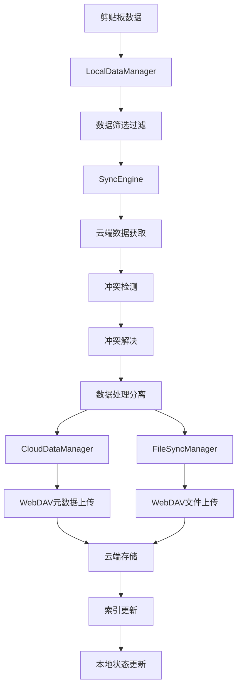
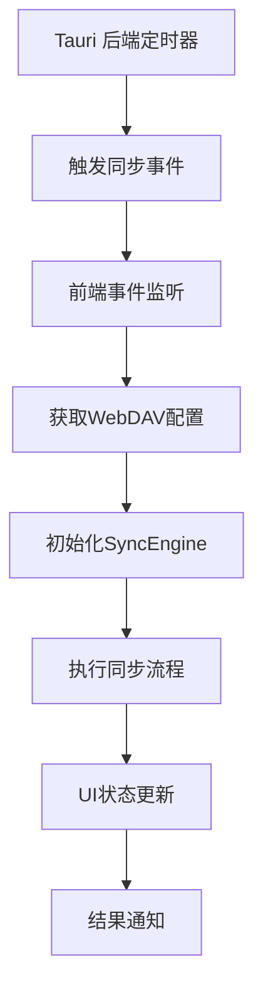
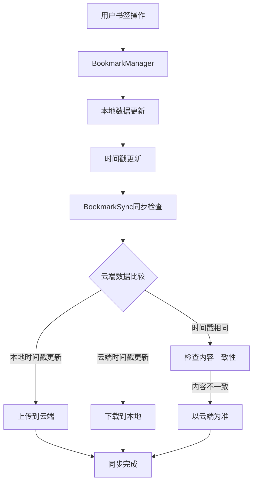

# EcoPaste 云同步架构文档

## 概述

EcoPaste-Sync 是基于 Tauri v2 的跨平台剪贴板管理工具，采用 WebDAV 协议实现云同步功能。该架构遵循本地优先设计原则，使用现代 Web 技术栈（React 18 + TypeScript + Vite）构建前端，Rust 实现后端核心功能，SQLite 作为本地数据存储，支持多设备间的剪贴板数据同步。

## 架构原则

### 1. 本地优先架构 (Local-First Architecture)

- **前端优先响应**：React + Vite 提供毫秒级用户交互响应
- **本地数据完整性**：SQLite 数据库确保离线可用性
- **渐进增强**：网络连接时提供云同步功能
- **事务安全**：基于 Tauri SQL 的事务性数据操作

### 2. 现代技术栈

- **前端**：React 18 + TypeScript + UnoCSS + Ant Design 5
- **状态管理**：Valtio 响应式状态管理
- **构建工具**：Vite 快速开发和优化构建
- **后端**：Tauri v2 + Rust 插件系统
- **数据存储**：SQLite 本地存储 + WebDAV 云端同步

### 3. 插件化架构

- **模块化设计**：每个同步功能独立实现
- **自定义 Tauri 插件**：WebDAV、自动同步、窗口管理等
- **可扩展传输层**：支持未来多云服务商
- **统一 API 接口**：简化前端与后端通信

### 4. 智能冲突解决

- **基于校验和的真实冲突检测**：避免伪冲突
- **多策略解决方案**：本地优先、远程优先、智能合并
- **设备标识追踪**：跨设备数据来源识别
- **时间戳辅助决策**：智能选择最新数据版本

### 5. 性能优化

- **增量同步**：仅同步变更数据，减少网络传输
- **文件按需下载**：大文件支持懒加载
- **数据库索引优化**：快速查询和过滤
- **缓存策略**：WebDAV 响应和文件缓存

## 核心模块架构

### 1. 前端层 (Frontend Layer)

#### 技术栈组件

- **React 18**: 现代化用户界面框架，支持并发特性和Hooks
- **TypeScript**: 严格类型检查，提供完整的代码智能提示
- **Vite**: 快速开发服务器和优化的生产构建
- **UnoCSS**: 原子化CSS框架，按需生成样式
- **Ant Design 5**: 企业级UI组件库，集成Happy主题
- **React Router v6**: 客户端路由，使用hash路由模式
- **Valtio**: 响应式状态管理，提供高性能状态更新
- **React i18next**: 国际化支持，多语言界面

#### 用户界面组件

**主界面组件 (`src/pages/Main/`)**:
- **`index.tsx`**: 主剪贴板界面，集成事件总线和状态管理
- **`components/Dock/`**: Dock风格界面布局
- **`components/Float/`**: 浮动窗口界面
- **`components/List/`**: 剪贴板列表组件
  - **`Item/`**: 剪贴板项目，支持多种内容类型:
    - **`Text/`**: 文本内容展示和编辑
    - **`Image/`**: 图片内容预览和管理
    - **`HTML/`**: HTML内容渲染
    - **`RTF/`**: 富文本内容显示
    - **`Files/`**: 文件列表管理和操作
    - **`SyncStatus/`**: 同步状态指示器
  - **`NoteModal/`**: 备注编辑弹窗
  - **`EditModal/`**: 项目编辑弹窗
- **`components/Search/`**: 搜索功能组件
- **`components/Group/`**: 分组管理
- **`components/Pin/`**: 固定功能
- **`components/CustomGroupManager/`**: 自定义分组管理

**设置界面组件 (`src/pages/Preference/`)**:
- **`index.tsx`**: 设置主界面，分类管理
- **`components/CloudSync/index.tsx`**: 云同步设置界面（核心功能）
  - WebDAV服务器配置
  - 同步模式开关控制
  - 自动同步设置
  - 冲突解决策略配置
- **`components/General/`**: 通用设置（主题、语言、行高等）
- **`components/Clipboard/`**: 剪贴板设置（自动粘贴、窗口位置等）
- **`components/History/`**: 历史记录管理（删除策略、最大数量等）
- **`components/Shortcut/`**: 快捷键管理
- **`components/Backup/`**: 备份功能
- **`components/About/`**: 关于信息

#### 状态管理架构

- **globalStore**: 全局应用状态（Valtio proxy）
  ```typescript
  interface GlobalState {
    // 外观设置
    appearance: { theme: "light" | "dark" | "auto"; language: string };
    // 快捷键配置
    shortcuts: Record<string, string>;
    // 云同步设置
    cloudSync: { enabled: boolean; webdavConfig: WebDAVConfig };
    // 窗口设置
    window: { alwaysOnTop: boolean; opacity: number };
  }
  ```

- **clipboardStore**: 剪贴板专用状态
  ```typescript
  interface ClipboardState {
    // 窗口状态
    windowState: { width: number; height: number };
    // 音效设置
    audioEnabled: boolean;
    // 搜索和过滤
    searchQuery: string;
    // 同步状态
    syncStatus: SyncStatus;
  }
  ```

#### 路由和导航

- **Hash路由模式**: 支持跨平台兼容性
- **路由配置** (`src/router/index.tsx`):
  - `/`: 主剪贴板界面
  - `/preference/*`: 设置页面路由
  - 支持嵌套路由和动态路由

### 2. 业务逻辑层 (Business Logic Layer)

#### 核心同步引擎 (`src/utils/syncEngine.ts`)

```typescript
export class SyncEngine {
  // 核心同步功能
  async performBidirectionalSync(): Promise<SyncResult>
  async fullSyncUpload(): Promise<SyncResult>
  async fullSyncDownload(): Promise<SyncResult>

  // 初始化和配置管理
  async initialize(config: WebDAVConfig): Promise<boolean>
  setSyncModeConfig(config: SyncModeConfig): void

  // 设备和状态管理
  private deviceId: string
  private isOnline: boolean
  private lastSyncTime: number
  private syncInProgress: boolean
}
```

**核心功能**:

- **双向同步协调**: 完整的上传下载流程管理
- **智能冲突检测**: 基于校验和、时间戳、设备ID的综合判断
- **设备管理**: 唯一设备标识和跨设备数据追踪
- **状态维护**: 实时同步状态和错误处理

#### 数据管理器模块

**云端数据管理器 (`src/utils/cloudDataManager.ts`)**:

```typescript
export class CloudDataManager {
  // 云端数据操作
  async uploadCloudData(cloudData: CloudSyncData): Promise<boolean>
  async downloadCloudData(): Promise<CloudSyncData | null>

  // 兼容性处理
  async convertLegacyFormat(): Promise<void>
  async validateCloudData(data: any): Promise<boolean>

  // 索引管理
  async updateCloudIndex(items: SyncItem[]): Promise<void>
  async deleteItemsFromCloud(itemIds: string[]): Promise<void>
}
```

**文件同步管理器 (`src/utils/fileSyncManager.ts`)**:

```typescript
export class FileSyncManager {
  // 文件操作
  async handleFilePackageUploads(items: SyncItem[]): Promise<void>
  async handleFilePackageDownloads(items: SyncItem[]): Promise<void>

  // 文件处理
  private async uploadFile(filePath: string, remotePath: string): Promise<boolean>
  private async downloadFile(remotePath: string, localPath: string): Promise<boolean>

  // 路径和元数据管理
  private extractFilePaths(item: SyncItem): string[]
  private generateFileMetadata(filePath: string): FileMetadata
  private validateFilePath(filePath: string): boolean
}
```

**本地数据管理器 (`src/utils/localDataManager.ts`)**:

```typescript
export class LocalDataManager {
  // 数据筛选和过滤
  async filterItemsBySyncMode(config: SyncModeConfig): Promise<SyncItem[]>
  async getModifiedSince(timestamp: number): Promise<SyncItem[]>

  // 数据库操作
  async updateSyncStatus(items: SyncItem[]): Promise<void>
  async applySyncChanges(items: SyncItem[], deletedItems: string[]): Promise<void>

  // 收藏状态管理
  async updateFavoriteStatus(itemId: string, favorite: boolean): Promise<void>
  async updateItemNote(itemId: string, note: string): Promise<void>
}
```

#### 专用功能模块

**书签管理器 (`src/utils/bookmarkManager.ts`)**:

```typescript
export class BookmarkManager {
  // 书签分组管理
  async createBookmarkGroup(name: string): Promise<string>
  async updateBookmarkGroup(groupId: string, updates: Partial<BookmarkGroup>): Promise<void>
  async deleteBookmarkGroup(groupId: string): Promise<void>

  // 书签操作
  async addToBookmark(itemId: string, groupId?: string): Promise<void>
  async removeFromBookmark(itemId: string): Promise<void>
  async updateBookmarkOrder(groupId: string, itemIds: string[]): Promise<void>

  // 数据持久化
  private saveBookmarkGroups(): Promise<void>
  private loadBookmarkGroups(): Promise<BookmarkGroup[]>
}
```

**书签同步管理器 (`src/utils/bookmarkSync.ts`)**:

```typescript
export class BookmarkSync {
  // 书签数据同步
  async syncBookmarks(): Promise<SyncResult>

  // 时间戳冲突解决
  private resolveBookmarkConflicts(local: BookmarkData, remote: BookmarkData): BookmarkData

  // 设备初始化
  async initializeDeviceBookmarks(): Promise<void>

  // 智能合并
  private mergeBookmarkData(local: BookmarkData, remote: BookmarkData): BookmarkData
}
```

**冲突解决器 (`src/utils/syncConflictResolver.ts`)**:

```typescript
export const detectRealConflicts = (
  localItems: SyncItem[],
  cloudItems: SyncItem[]
): Array<{ localItem: SyncItem; remoteItem: SyncItem }>

export const syncConflictResolver = (
  localItem: SyncItem,
  remoteItem: SyncItem,
  strategy: ConflictResolutionStrategy
): SyncItem
```

**实时同步协调器 (`src/utils/realtimeSync.ts`)**:

```typescript
export class RealtimeSync {
  // 事件监听和协调
  async startRealtimeSync(): Promise<void>
  async stopRealtimeSync(): Promise<void>

  // 同步事件处理
  private handleSyncEvent(): Promise<void>
  private debouncedSync: () => void
}
```

#### 类型定义系统 (`src/types/`)

**同步相关类型 (`src/types/sync.d.ts`)**:

```typescript
// 核心同步数据结构
export interface SyncItem extends BaseClipboardItem {
  count: number;           // 同步必需字段
  lastModified: number;    // 最后修改时间
  deviceId: string;        // 创建设备ID
  _syncType?: string;      // 同步类型标识
}

// 云端数据格式
export interface CloudSyncData {
  format: "unified";
  timestamp: number;
  deviceId: string;
  items: SyncItem[];
  deletedItems: string[];
  statistics: DataStatistics;
}

// 同步配置
export interface SyncModeConfig {
  settings: {
    includeText: boolean;    // 文本内容（固定启用）
    includeHtml: boolean;    // HTML内容（固定启用）
    includeRtf: boolean;     // 富文本内容（固定启用）
    includeImages: boolean;  // 图片内容（文件模式开关）
    includeFiles: boolean;   // 文件内容（文件模式开关）
    onlyFavorites: boolean;  // 仅同步收藏内容（收藏模式开关）
  };
}

// 同步结果
export interface SyncResult {
  success: boolean;
  uploaded: number;
  downloaded: number;
  conflicts: number;
  errors: string[];
  duration: number;
}
```

### 3. 网络传输层 (Network Layer)

#### WebDAV 前端接口 (`src/plugins/webdav.ts`)

```typescript
// WebDAV 配置接口
export interface WebDAVConfig {
  url: string;
  username: string;
  password: string;
  path: string;
  timeout: number;
}

// 连接测试结果
export interface ConnectionTestResult {
  success: boolean;
  latency_ms: number;
  status_code?: number;
  error_message?: string;
  server_info?: string;
}

// WebDAV 操作结果
export interface WebDAVTestResult {
  success: boolean;
  operations: Record<string, OperationResult>;
  error_message?: string;
}

// 主要WebDAV操作函数
export const testConnection = async (config: WebDAVConfig): Promise<ConnectionTestResult>
export const testWebDAVOperations = async (config: WebDAVConfig): Promise<WebDAVTestResult>
export const uploadFile = async (config: WebDAVConfig, localPath: string, remotePath: string): Promise<FileUploadResult>
export const downloadFile = async (config: WebDAVConfig, remotePath: string): Promise<FileDownloadResult>
export const deleteFile = async (config: WebDAVConfig, remotePath: string): Promise<boolean>
export const listFiles = async (config: WebDAVConfig, path: string): Promise<string[]>
```

**核心功能**:

- **连接管理**: WebDAV 服务器连接测试和配置验证
- **文件操作**: 上传、下载、删除、列表等基础操作
- **错误处理**: 详细的错误信息和状态码处理
- **性能监控**: 连接延迟和操作耗时统计

#### Tauri 后端插件架构 (`src-tauri/src/plugins/`)

**WebDAV 插件 (`src-tauri/src/plugins/webdav/`)**:

```rust
// lib.rs - 插件定义和命令注册
#[tauri::command]
async fn set_server_config(config: WebDAVConfig) -> Result<(), String>

#[tauri::command]
async fn test_webdav_connection(config: WebDAVConfig) -> Result<ConnectionTestResult, String>

#[tauri::command]
async fn upload_file(config: WebDAVConfig, local_path: String, remote_path: String) -> Result<FileUploadResult, String>

#[tauri::command]
async fn download_file(config: WebDAVConfig, remote_path: String) -> Result<FileDownloadResult, String>
```

**Rust 核心功能**:

- **HTTP客户端优化**: 使用reqwest进行高效HTTP请求
- **流式传输**: 大文件的流式上传下载
- **自动目录创建**: MKCOL方法递归创建目录结构
- **认证管理**: Base64编码的基本认证
- **连接池**: 复用HTTP连接提升性能

**自动同步插件 (`src-tauri/src/plugins/auto_sync/`)**:

```rust
// 全局状态管理
static AUTO_SYNC_STATUS: LazyLock<Arc<Mutex<Option<AutoSyncStatus>>>> =
    LazyLock::new(|| Arc::new(Mutex::new(None)));

static TIMER_HANDLE: LazyLock<Arc<Mutex<Option<thread::JoinHandle<()>>>>> =
    LazyLock::new(|| Arc::new(Mutex::new(None)));

// 主要命令
#[tauri::command]
async fn start_auto_sync(config: AutoSyncConfig) -> Result<(), String>

#[tauri::command]
async fn stop_auto_sync() -> Result<(), String>

#[tauri::command]
async fn get_sync_status() -> Result<Option<AutoSyncStatus>, String>
```

**核心特性**:

- **线程安全**: 使用Arc<Mutex<>>管理全局状态
- **定时器管理**: 可配置的自动同步间隔（1、2、6、12、24小时）
- **事件发射**: 触发前端同步事件
- **优雅关闭**: 安全的线程和资源清理

**窗口管理插件 (`src-tauri/src/plugins/window/`)**:

```rust
#[tauri::command]
async fn set_window_always_on_top(window: tauri::Window, always_on_top: bool) -> Result<(), String>

#[tauri::command]
async fn set_window_opacity(window: tauri::Window, opacity: f64) -> Result<(), String>

#[tauri::command]
async fn set_window_ignore_cursor_events(window: tauri::Window, ignore: bool) -> Result<(), String>
```

**剪贴板插件 (`src-tauri/src/plugins/clipboard/`)**:

```rust
#[tauri::command]
async fn start_clipboard_monitor() -> Result<(), String>

#[tauri::command]
async fn stop_clipboard_monitor() -> Result<(), String>

#[tauri::command]
async fn get_clipboard_content() -> Result<ClipboardContent, String>
```

**OCR 插件 (`src-tauri/src/plugins/ocr/`)**:

```rust
#[tauri::command]
async fn extract_text_from_image(image_path: String) -> Result<String, String>

#[tauri::command]
async fn detect_image_text(image_path: String) -> Result<bool, String>
```

#### Tauri 应用配置 (`src-tauri/tauri.conf.json`)

```json
{
  "productName": "EcoPaste",
  "version": "0.2.3",
  "identifier": "com.ecopaste.app",
  "build": {
    "beforeBuildCommand": "pnpm run build:vite",
    "beforeDevCommand": "pnpm run dev:vite",
    "devUrl": "http://localhost:3000",
    "frontendDist": "../dist"
  },
  "app": {
    "windows": [
      {
        "label": "main",
        "title": "EcoPaste",
        "width": 360,
        "height": 600,
        "minWidth": 300,
        "minHeight": 400,
        "transparent": true,
        "decorations": false,
        "alwaysOnTop": true,
        "skipTaskbar": true
      },
      {
        "label": "preference",
        "title": "EcoPaste-Preference",
        "url": "#/preference",
        "width": 700,
        "height": 480,
        "center": true,
        "resizable": true,
        "minimizable": false,
        "maximizable": false,
        "visible": false
      }
    ]
  },
  "bundle": {
    "active": true,
    "targets": "all",
    "icon": ["icons/32x32.png", "icons/128x128.png", "icons/128x128@2x.png", "icons/icon.icns", "icons/icon.ico"]
  },
  "plugins": {
    "eco-webdav": {},
    "eco-auto-sync": {},
    "eco-window": {},
    "eco-clipboard": {},
    "eco-ocr": {},
    "eco-paste": {},
    "eco-autostart": {}
  }
}
```

### 4. 数据存储层 (Data Storage Layer)

#### SQLite 数据库 (`src/database/index.tsx`)

**核心数据库操作**:

```typescript
// 基础数据库操作
export const executeSQL = async <T = any>(sql: string, params?: any[]): Promise<T[]>
export const selectSQL = async <T = any>(sql: string, params?: any[]): Promise<T[]>
export const insertSQL = async <T = any>(sql: string, params?: any[]): Promise<T>
export const updateSQL = async <T = any>(sql: string, params?: any[]): Promise<T>
export const deleteSQL = async <T = any>(sql: string, params?: any[]): Promise<T>

// 高级数据操作
export const getHistoryData = async (options?: GetHistoryOptions): Promise<HistoryItem[]>
export const insertHistoryData = async (data: Partial<HistoryItem>[]): Promise<void>
export const deleteHistoryData = async (ids: string[]): Promise<void>
export const updateHistoryData = async (data: Partial<HistoryItem>): Promise<void>

// 同步相关操作
export const getSyncData = async (syncMode: SyncModeConfig): Promise<SyncItem[]>
export const updateSyncStatus = async (items: SyncItem[]): Promise<void>
export const convertLocalToSyncData = async (items: HistoryItem[]): Promise<SyncItem[]>
export const applySyncData = async (items: SyncItem[], deletedItems: string[]): Promise<void>
```

**数据库表结构**:

```sql
-- 剪贴板历史记录表
CREATE TABLE IF NOT EXISTS history (
  id TEXT PRIMARY KEY,                    -- 唯一标识符 (UUID)
  type TEXT NOT NULL,                     -- 数据类型 (text, image, html, rtf, files)
  value TEXT,                             -- 文本/HTML/RTF内容
  files TEXT,                             -- 文件路径/元数据(JSON)
  hash TEXT,                              -- 内容哈希值 (去重)
  favorite INTEGER DEFAULT 0,              -- 是否收藏
  note TEXT,                              -- 用户备注
  group TEXT DEFAULT "default",           -- 分组名称
  subtype TEXT,                           -- 子类型 (code, image类型等)
  width INTEGER,                          -- 图片/文件宽度
  height INTEGER,                         -- 图片/文件高度
  search TEXT,                            -- 搜索关键词
  count INTEGER DEFAULT 0,                -- 使用次数
  create_time INTEGER DEFAULT (strftime('%s', 'now')), -- 创建时间
  sync_status INTEGER DEFAULT 0,          -- 同步状态 (0:未同步, 1:已同步)
  is_cloud_data INTEGER DEFAULT 0,        -- 是否云端数据
  is_code INTEGER DEFAULT 0,              -- 是否代码内容
  code_language TEXT,                     -- 代码语言
  last_modified INTEGER DEFAULT (strftime('%s', 'now')), -- 最后修改时间
  device_id TEXT,                         -- 创建设备ID
  deleted INTEGER DEFAULT 0               -- 软删除标识
);

-- 同步日志表 (可选)
CREATE TABLE IF NOT EXISTS sync_logs (
  id INTEGER PRIMARY KEY AUTOINCREMENT,
  timestamp INTEGER DEFAULT (strftime('%s', 'now')),
  operation TEXT NOT NULL,                -- 操作类型 (upload, download, conflict)
  item_id TEXT,                          -- 项目ID
  device_id TEXT,                         -- 设备ID
  success INTEGER DEFAULT 0,              -- 是否成功
  error_message TEXT,                     -- 错误信息
  FOREIGN KEY (item_id) REFERENCES history(id)
);

-- 书签分组表
CREATE TABLE IF NOT EXISTS bookmark_groups (
  id TEXT PRIMARY KEY,                    -- 分组ID
  name TEXT NOT NULL,                     -- 分组名称
  icon TEXT,                              -- 分组图标
  color TEXT,                             -- 分组颜色
  sort_order INTEGER DEFAULT 0,           -- 排序顺序
  create_time INTEGER DEFAULT (strftime('%s', 'now')),
  last_modified INTEGER DEFAULT (strftime('%s', 'now')),
  device_id TEXT                          -- 创建设备ID
);

-- 书签项目关联表
CREATE TABLE IF NOT EXISTS bookmark_items (
  id INTEGER PRIMARY KEY AUTOINCREMENT,
  group_id TEXT NOT NULL,                 -- 分组ID
  item_id TEXT NOT NULL,                  -- 历史记录ID
  sort_order INTEGER DEFAULT 0,           -- 排序顺序
  add_time INTEGER DEFAULT (strftime('%s', 'now')),
  FOREIGN KEY (group_id) REFERENCES bookmark_groups(id),
  FOREIGN KEY (item_id) REFERENCES history(id)
);
```

**智能去重算法**:

```typescript
export const generateContentHash = (item: Partial<HistoryItem>): string => {
  // 根据类型生成不同的哈希策略
  switch (item.type) {
    case 'text':
    case 'html':
    case 'rtf':
      return crypto.createHash('md5').update(item.value || '').digest('hex');

    case 'image':
      // 基于图片尺寸和内容哈希
      const imageHash = item.value ? crypto.createHash('md5').update(item.value).digest('hex') : '';
      return `${item.type}_${item.width}_${item.height}_${imageHash}`;

    case 'files':
      // 基于文件路径和大小
      const files = item.files ? JSON.parse(item.files) : [];
      const fileHash = files.map(f => `${f.path}_${f.size}`).join('|');
      return `${item.type}_${crypto.createHash('md5').update(fileHash).digest('hex')}`;

    default:
      return crypto.createHash('md5').update(JSON.stringify(item)).digest('hex');
  }
};

export const isDuplicateItem = (newItem: Partial<HistoryItem>, existingItem: HistoryItem): boolean => {
  // 基于类型和内容的智能去重
  if (newItem.type !== existingItem.type) return false;

  switch (newItem.type) {
    case 'text':
    case 'html':
    case 'rtf':
      return newItem.value === existingItem.value;

    case 'image':
      return newItem.width === existingItem.width &&
             newItem.height === existingItem.height &&
             newItem.value === existingItem.value;

    case 'files':
      const newFiles = newItem.files ? JSON.parse(newItem.files) : [];
      const existingFiles = existingItem.files ? JSON.parse(existingItem.files) : [];
      return JSON.stringify(newFiles.map(f => f.path)) === JSON.stringify(existingFiles.map(f => f.path));

    default:
      return false;
  }
};
```

#### 云端存储结构

**WebDAV 云端目录结构**:

```
用户配置的同步路径/
├── sync-data.json              # 统一数据索引文件
├── store-config.json           # 应用配置同步文件
└── files/                      # 文件存储目录
    ├── item1_timestamp_filename.ext
    ├── item2_timestamp_image.png
    └── item3_timestamp_archive.zip
```

**sync-data.json 结构**:

```json
{
  "format": "unified",
  "timestamp": 1703123456789,
  "deviceId": "windows-abc123def456",
  "lastSyncTime": 1703123456789,
  "conflictResolution": "merge",
  "networkQuality": "high",
  "performanceMetrics": {
    "uploadSpeed": 1048576,
    "downloadSpeed": 2097152,
    "latency": 150
  },
  "items": [
    {
      "id": "unique-item-id",
      "type": "text",
      "value": "文本内容",
      "hash": "content-md5-hash",
      "favorite": false,
      "note": "用户备注",
      "group": "default",
      "subtype": "plain",
      "width": 0,
      "height": 0,
      "search": "搜索关键词",
      "count": 5,
      "createTime": 1703123456789,
      "syncStatus": 1,
      "isCloudData": true,
      "isCode": false,
      "codeLanguage": "",
      "lastModified": 1703123456789,
      "deviceId": "windows-abc123def456",
      "_syncType": "text",
      "_originalPath": "",
      "_originalSize": 0,
      "_compressedSize": 0,
      "_originalFiles": null,
      "lazyDownload": false
    }
  ],
  "deletedItems": [
    "deleted-item-id-1",
    "deleted-item-id-2"
  ],
  "statistics": {
    "totalItems": 150,
    "textItems": 80,
    "imageItems": 40,
    "fileItems": 30,
    "favoriteItems": 25,
    "dataChecksum": "sha256-hash-of-all-data"
  }
}
```

**文件命名规则**:

- **{itemId}_{timestamp}_{originalName}**: 唯一标识+时间戳+原名
- **最大1-100MB可配置**: 用户可配置文件大小限制（默认10MB），超出跳过并记录

```typescript
export const generateRemoteFileName = (item: SyncItem, originalPath: string): string => {
  const timestamp = Date.now();
  const originalName = path.basename(originalPath);
  const extension = path.extname(originalName);
  const nameWithoutExt = path.basename(originalName, extension);

  return `${item.id}_${timestamp}_${nameWithoutExt}${extension}`;
};

export const validateRemoteFileName = (fileName: string): boolean => {
  // 验证文件名格式: itemId_timestamp_originalName
  const pattern = /^[a-f0-9-]+_\d+_.+\..+$/;
  return pattern.test(fileName);
};
```

#### 本地文件缓存

**缓存目录结构**:

```
应用数据目录/
├── databases/
│   └── ecopaste.db             # SQLite主数据库
├── cache/
│   ├── webdav/                 # WebDAV文件缓存
│   │   ├── thumbnails/         # 图片缩略图
│   │   └── temp/              # 临时文件
│   └── search/                 # 搜索索引缓存
├── config/
│   ├── settings.json           # 应用设置
│   ├── webdav-config.json      # WebDAV配置
│   └── bookmark-groups.json    # 书签分组
└── logs/
    ├── sync.log                # 同步日志
    └── app.log                 # 应用日志
```

**缓存管理策略**:

```typescript
export class CacheManager {
  // 缓存清理
  async cleanExpiredCache(maxAge: number): Promise<void>

  // 缓存大小限制
  async enforceCacheSizeLimit(maxSize: number): Promise<void>

  // 智能缓存淘汰 (LRU)
  async evictLeastRecentlyUsed(): Promise<void>

  // 文件完整性验证
  async validateCachedFile(filePath: string, expectedHash: string): Promise<boolean>
}
```
  
## 数据流架构

### 主要同步流程



### 自动同步流程



### 文件处理流程


### 书签同步流程



## 关键技术实现

### 1. 统一数据格式

#### SyncItem - 核心同步数据单元

```typescript
interface SyncItem extends BaseClipboardItem {
  count: number; // 使用次数（同步时必需）
  lastModified: number; // 最后修改时间（同步时必需）
  deviceId: string; // 创建设备ID（同步时必需）

  // 同步专用字段
  _syncType?: string; // 同步类型标识
  _originalPath?: string; // 原始路径
  _originalSize?: number; // 原始大小
  _compressedSize?: number; // 压缩后大小
  _originalFiles?: Array<FileMetadata>; // 原始文件信息
  lazyDownload?: boolean; // 按需下载标识
}
```

#### CloudSyncData - 统一云端数据格式

```typescript
interface CloudSyncData {
  format: "unified";
  timestamp: number;
  deviceId: string;
  lastSyncTime: number;
  conflictResolution: "local" | "remote" | "merge" | "prompt";
  networkQuality: "high" | "medium" | "low";
  performanceMetrics: PerformanceMetrics;
  items: SyncItem[]; // 完整的同步数据
  totalItems: number;
  dataChecksum: string;
  deletedItems: string[];
  statistics: DataStatistics;
}
```

### 2. 同步模式配置

#### 双开关模式

EcoPaste 采用简洁的双开关模式来控制同步内容：

```typescript
// 同步模式配置
export interface SyncModeConfig {
  settings: {
    includeText: boolean;   // 文本内容（总是启用）
    includeHtml: boolean;   // HTML 内容（总是启用）
    includeRtf: boolean;    // 富文本内容（总是启用）
    includeImages: boolean; // 图片内容（文件模式开关）
    includeFiles: boolean;  // 文件内容（文件模式开关）
    onlyFavorites: boolean; // 仅同步收藏内容（收藏模式开关）
  };
}

// 默认配置
export const getDefaultSyncModeConfig = (): SyncModeConfig => {
  return {
    settings: {
      includeText: true,    // 总是启用
      includeHtml: true,    // 总是启用
      includeRtf: true,     // 总是启用
      includeImages: false, // 文件模式开关，默认关闭
      includeFiles: false,  // 文件模式开关，默认关闭
      onlyFavorites: false, // 收藏模式开关，默认关闭
    },
  };
};
```

#### 配置说明

**内容类型开关：**

- **文本类内容**（文本、HTML、富文本）：始终启用同步
- **文件类内容**（图片、文件）：通过"文件模式"开关控制
- **收藏模式**：通过"收藏模式"开关控制仅同步收藏内容

| 配置项 | 类型 | 说明 |
|--------|------|------|
| `includeText` | boolean | 文本内容同步（固定启用） |
| `includeHtml` | boolean | HTML 内容同步（固定启用） |
| `includeRtf` | boolean | 富文本内容同步（固定启用） |
| `includeImages` | boolean | 图片内容同步（文件模式开关） |
| `includeFiles` | boolean | 文件内容同步（文件模式开关） |
| `onlyFavorites` | boolean | 仅同步收藏内容（收藏模式开关） |

### 3. 冲突检测和解决

#### 真实冲突检测算法

```typescript
export const detectRealConflicts = (
  localItems: SyncItem[],
  cloudItems: SyncItem[]
): Array<{ localItem: SyncItem; remoteItem: SyncItem }> => {
  const conflicts = [];
  const cloudItemMap = new Map(cloudItems.map((item) => [item.id, item]));

  for (const localItem of localItems) {
    const cloudItem = cloudItemMap.get(localItem.id);
    if (cloudItem) {
      // 基于校验和的内容比较
      const hasChecksumConflict =
        localItem.checksum &&
        cloudItem.checksum &&
        localItem.checksum !== cloudItem.checksum;

      // 收藏状态和备注变更检测
      const hasFavoriteConflict = localItem.favorite !== cloudItem.favorite;
      const hasNoteConflict = (localItem.note || "") !== (cloudItem.note || "");

      if (hasChecksumConflict || hasFavoriteConflict || hasNoteConflict) {
        conflicts.push({ localItem, remoteItem: cloudItem });
      }
    }
  }
  return conflicts;
};
```

#### 智能合并策略

```typescript
function mergeItems(localItem: SyncItem, remoteItem: SyncItem): SyncItem {
  const lastModified = Math.max(
    localItem.lastModified || 0,
    remoteItem.lastModified || 0
  );

  // 合并策略：收藏状态优先本地，备注选择非空较新版本
  const localNote = (localItem.note || "").trim();
  const remoteNote = (remoteItem.note || "").trim();
  const finalNote = localNote || remoteNote;

  return {
    ...localItem, // 优先使用本地版本作为基础
    lastModified, // 使用最新的修改时间
    note: finalNote, // 合并备注
    // 确保其他重要字段不丢失
    search: localItem.search || remoteItem.search,
    checksum: localItem.checksum || remoteItem.checksum,
  };
}
```

### 4. 文件同步优化

#### 文件路径处理

支持多种文件路径格式的智能提取：

- 简单字符串路径
- 文件路径数组
- 复合对象格式（包含 originalPath、path、fileName 等）
- 嵌套路径结构

#### 文件元数据管理

```typescript
interface FileMetadata {
  fileName: string;
  originalPath: string;
  remotePath: string;
  size: number;
  timestamp: number;
  md5?: string; // 文件完整性校验
}
```

#### 跨设备路径一致性

- 智能路径验证和恢复
- 本地缓存策略
- 文件名标准化处理

### 5. WebDAV 协议实现

#### 连接管理和认证

```rust
fn build_auth_header(username: &str, password: &str) -> String {
    let credentials = format!("{}:{}", username, password);
    let encoded = base64::engine::general_purpose::STANDARD.encode(credentials);
    format!("Basic {}", encoded)
}
```

#### 自动目录创建

```rust
async fn ensure_directory_exists_for_path(config: &WebDAVConfig, dir_path: &str) -> Result<()> {
    // 使用 MKCOL 方法递归创建目录
    // 处理已存在目录的冲突
    // 验证目录创建结果
}
```

### 6. 后端自动同步

#### 线程安全的全局状态

```rust
static AUTO_SYNC_STATUS: LazyLock<Arc<Mutex<Option<AutoSyncStatus>>>> =
    LazyLock::new(|| Arc::new(Mutex::new(None)));

static TIMER_HANDLE: LazyLock<Arc<Mutex<Option<thread::JoinHandle<()>>>>> =
    LazyLock::new(|| Arc::new(Mutex::new(None)));
```

#### 定时器管理

- 首次延迟 30 秒执行，确保应用完全启动
- 可配置的同步间隔（1、2、6、12、24 小时）
- 事件驱动的同步触发机制

## 配置和设置

### WebDAV 配置

```typescript
interface WebDAVConfig {
  url: string; // WebDAV 服务器地址
  username: string; // 用户名
  password: string; // 密码
  path: string; // 同步路径
  timeout: number; // 连接超时时间
}
```

### 同步模式配置

```typescript
interface SyncModeConfig {
  settings: {
    includeText: boolean;   // 文本内容（总是启用）
    includeHtml: boolean;   // HTML 内容（总是启用）
    includeRtf: boolean;    // 富文本内容（总是启用）
    includeImages: boolean; // 图片内容（文件模式开关）
    includeFiles: boolean;  // 文件内容（文件模式开关）
    onlyFavorites: boolean; // 仅同步收藏内容（收藏模式开关）
  };
}
```

### 自动同步配置

```typescript
interface AutoSyncConfig {
  enabled: boolean;
  intervalHours: 1 | 2 | 6 | 12 | 24;
}
```

## 安全性考虑

### 1. 数据传输安全

- HTTPS/TLS 加密传输支持
- Base64 编码的基础认证
- 敏感信息不记录日志

### 2. 数据存储安全

- 本地数据库安全存储
- WebDAV 配置独立管理
- 临时文件和缓存清理

### 3. 访问控制

- WebDAV 服务器权限验证
- 文件访问范围限制
- 设备标识和管理

## 性能优化

### 1. 数据传输优化

- 统一数据格式减少冗余
- 增量同步策略
- 文件大小限制和检查

### 2. 本地处理优化

- 数据库索引和查询优化
- 文件缓存策略
- 异步操作和并发控制

### 3. 网络请求优化

- 连接复用和超时管理
- 智能重试机制
- 错误恢复和处理

## 监控和状态管理

### 1. 同步状态监控

```typescript
interface SyncStatus {
  isOnline: boolean;
  isSyncing: boolean;
  lastSyncTime: number;
  pendingCount: number;
  errorCount: number;
  syncProgress: number;
}
```

### 2. 实时状态更新

- Tauri 事件系统
- 前端状态自动更新
- 用户界面实时反馈

### 3. 错误处理和日志

- 分级日志记录
- 详细的错误信息
- 调试和故障排除支持

## 扩展性设计

### 1. 协议扩展

- 插件化传输层设计
- 统一的 API 接口
- 多云服务商支持准备

### 2. 功能扩展

- 数据类型扩展机制
- 自定义同步模式
- 插件化数据处理

### 3. 配置扩展

- 动态配置加载
- 环境特定配置
- 用户自定义选项

## 故障排除

### 常见问题和解决方案

#### 1. 连接问题

- **HTTP 401**: 认证失败，检查用户名密码
- **HTTP 409**: 目录创建冲突，检查路径配置
- **连接超时**: 网络问题或服务器不可达

#### 2. 同步问题

- **冲突循环**: 检查冲突解决策略配置
- **数据不一致**: 验证校验和计算逻辑
- **文件上传失败**: 检查文件大小和权限

#### 3. 性能问题

- **同步缓慢**: 检查网络带宽和数据量
- **内存占用高**: 优化缓存策略和批量处理
- **磁盘空间不足**: 清理临时文件和缓存

### 调试工具

- 详细日志输出
- 网络请求监控
- 数据库状态检查
- 同步状态追踪

---

该架构文档详细描述了 EcoPaste 云同步功能的完整技术实现，包括最新的自动同步、配置同步和统一数据格式等核心功能，为开发、维护和扩展提供了全面的技术参考。
