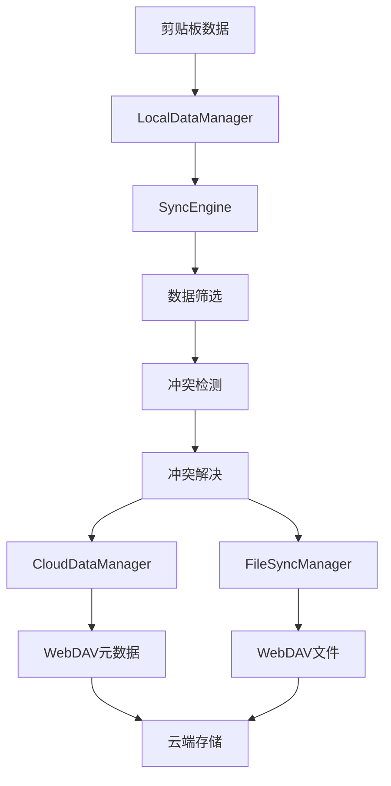

# EcoPaste 云同步架构文档

## 概述

EcoPaste 云同步功能基于 WebDAV 协议实现，采用本地优先的架构设计，支持多设备间的剪贴板数据同步。该架构注重数据安全、冲突解决和用户体验。

## 架构原则

### 1. 本地优先 (Local-First)
- 所有操作首先在本地完成，确保快速响应
- 本地数据完整性不依赖网络连接
- 支持离线使用，网络恢复后自动同步

### 2. 渐进式同步
- 只同步符合条件的数据类型和内容
- 支持过滤模式（收藏模式、类型过滤等）
- 增量同步减少网络传输

### 3. 数据分离
- 元数据与实际文件分离存储
- 轻量级索引 + 完整数据的混合架构
- 优化同步性能和存储空间

### 4. 冲突智能解决
- 基于校验和的真实冲突检测
- 多策略冲突解决（本地优先、远程优先、智能合并）
- 设备标识和时间戳辅助决策

## 核心模块架构

### 1. 前端层 (Frontend Layer)

#### 用户界面组件
- **CloudSync/index.tsx**: 主云同步设置界面
- **ImmediateSyncButton.tsx**: 立即同步按钮
- **syncModeConfig.ts**: 同步模式配置组件

#### 状态管理
- **global.ts**: 全局状态管理（同步状态、配置等）
- **useTauriListen.ts**: Tauri事件监听Hook

### 2. 业务逻辑层 (Business Logic Layer)

#### 同步引擎核心
- **SyncEngine**: 同步流程总控制器
  - 双向同步协调
  - 冲突检测和解决调度
  - 设备管理和同步状态维护

#### 数据管理器
- **LocalDataManager**: 本地数据管理
  - 数据库操作封装
  - 本地数据筛选和转换
  - 同步结果应用

- **CloudDataManager**: 云端数据管理
  - 云端索引下载和上传
  - 云端数据筛选
  - 轻量级指纹维护

- **FileSyncManager**: 文件同步管理
  - 文件上传下载处理
  - 文件元数据管理
  - 本地缓存和路径管理

#### 专用模块
- **AutoSyncManager**: 自动同步管理
  - 定时同步调度
  - 同步间隔管理
  - 自动触发控制

- **SyncConflictResolver**: 冲突解决器
  - 真实冲突检测
  - 多策略冲突解决
  - 智能合并算法

### 3. 网络传输层 (Network Layer)

#### WebDAV 客户端
- **webdav.ts**: WebDAV API 封装
  - 连接管理和认证
  - 文件操作抽象
  - 错误处理和重试

#### Tauri 插件
- **eco-webdav**: Rust WebDAV 实现
  - HTTP 请求优化
  - 目录自动创建
  - 文件流式传输

### 4. 数据存储层 (Data Storage Layer)

#### 本地存储
- **SQLite 数据库**: 主数据存储
  - 剪贴板历史记录
  - 同步状态和元数据
  - 配置信息

- **文件系统**: 文件缓存
  - 下载文件临时存储
  - 文件包解压目录

#### 云端存储
- **WebDAV 服务器**: 云端文件存储
  - `sync-data.json`: 数据索引文件
  - `files/`: 原始文件目录
  - 设备特定的数据文件

## 数据流架构

### 同步数据流程



### 文件处理流程


## 关键技术实现

### 1. 数据格式和转换

#### 历史数据格式 (HistoryTablePayload)
```typescript
interface HistoryTablePayload {
    id: string;
    type: "text" | "image" | "files" | "html" | "rtf";
    value: string; // JSON字符串或纯文本
    favorite: boolean;
    note?: string;
    // ... 其他元数据
}
```

#### 同步数据格式 (SyncItem)
```typescript
interface SyncItem {
    id: string;
    type: "text" | "image" | "files" | "html" | "rtf";
    value: string;
    favorite: boolean;
    checksum: string;
    timestamp: number;
    deviceId: string;
    // ... 同步专用字段
}
```

#### 云端指纹格式 (CloudItemFingerprint)
```typescript
interface CloudItemFingerprint {
    id: string;
    type: "text" | "image" | "files" | "html" | "rtf";
    checksum: string;
    size: number;
    timestamp: number;
    favorite: boolean;
    value?: string; // 文件/图片类型包含元数据
}
```

### 2. 冲突检测和解决

#### 真实冲突检测
- 基于校验和的内容比较
- 收藏状态和备注变更检测
- 避免误报的智能算法

#### 解决策略
- **本地优先**: 以本地数据为准
- **远程优先**: 以云端数据为准
- **智能合并**: 选择最佳属性组合

### 3. 文件同步优化

#### 路径处理
- 智能路径提取和验证
- 多格式兼容（数组、对象、字符串）
- 本地缓存和路径恢复

#### 传输优化
- 文件大小限制检查
- 断点续传支持
- 并发控制和重试机制

### 4. WebDAV 协议实现

#### 连接管理
- 基础认证支持
- 连接测试和验证
- 超时和错误处理

#### 目录操作
- 自动目录创建 (MKCOL)
- 路径规范化处理
- 权限检查

#### 文件操作
- 流式上传下载
- Content-Length 处理
- 冲突解决策略

## 配置和设置

### 同步模式配置
```typescript
interface SyncModeConfig {
    type: "all" | "filter";
    settings: {
        dataTypes: ("text" | "image" | "files" | "html" | "rtf")[];
        onlyFavorites: boolean;
        maxSize?: number;
        maxAge?: number;
    };
}
```

### WebDAV 配置
```typescript
interface WebDAVConfig {
    url: string;
    username: string;
    password: string;
    path: string;
    timeout: number;
}
```

### 自动同步配置
```typescript
interface AutoSyncConfig {
    enabled: boolean;
    intervalHours: 1 | 2 | 6 | 12 | 24;
}
```

## 安全性考虑

### 1. 数据传输安全
- HTTPS/TLS 加密传输
- 基础认证凭据保护
- 敏感信息不记录日志

### 2. 数据存储安全
- 本地数据库加密
- 配置信息安全存储
- 临时文件清理

### 3. 访问控制
- WebDAV 权限验证
- 文件访问范围限制
- 设备标识管理

## 性能优化

### 1. 数据传输优化
- 轻量级索引架构
- 增量同步策略
- 数据压缩支持

### 2. 本地处理优化
- 数据库索引优化
- 文件缓存策略
- 异步操作处理

### 3. 网络请求优化
- 请求合并和批处理
- 连接复用
- 智能重试机制

## 监控和日志

### 1. 同步状态监控
- 实时同步状态显示
- 错误统计和报告
- 性能指标收集

### 2. 日志系统
- 分级日志记录
- 调试信息输出
- 错误追踪和分析

### 3. 用户反馈
- 同步结果通知
- 进度指示器
- 错误提示信息

## 扩展性设计

### 1. 协议扩展
- 插件化传输层设计
- 多云服务商支持准备
- 自定义同步协议接口

### 2. 功能扩展
- 数据类型扩展机制
- 自定义冲突解决策略
- 插件化数据处理

### 3. 配置扩展
- 动态配置加载
- 环境特定配置
- 用户自定义选项

## 测试策略

### 1. 单元测试
- 核心算法测试
- 数据转换测试
- 错误处理测试

### 2. 集成测试
- 端到端同步流程测试
- 多设备同步测试
- 网络异常场景测试

### 3. 性能测试
- 大数据量同步测试
- 并发操作测试
- 长期稳定性测试

## 故障排除

### 常见问题
1. **HTTP 409 错误**: WebDAV 目录创建失败
2. **文件上传失败**: 权限或路径问题
3. **同步循环**: 冲突解决配置错误
4. **数据丢失**: 备份和恢复策略

### 调试工具
- 详细日志输出
- 网络请求监控
- 数据库状态检查
- 同步状态追踪

---

该架构文档描述了 EcoPaste 云同步功能的完整技术实现，为开发、维护和扩展提供了详细的技术参考。