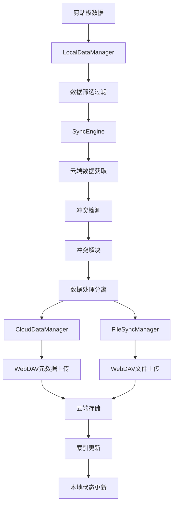
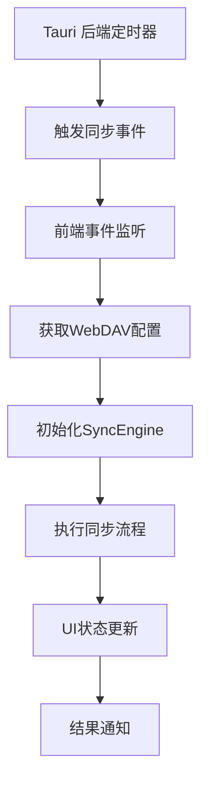
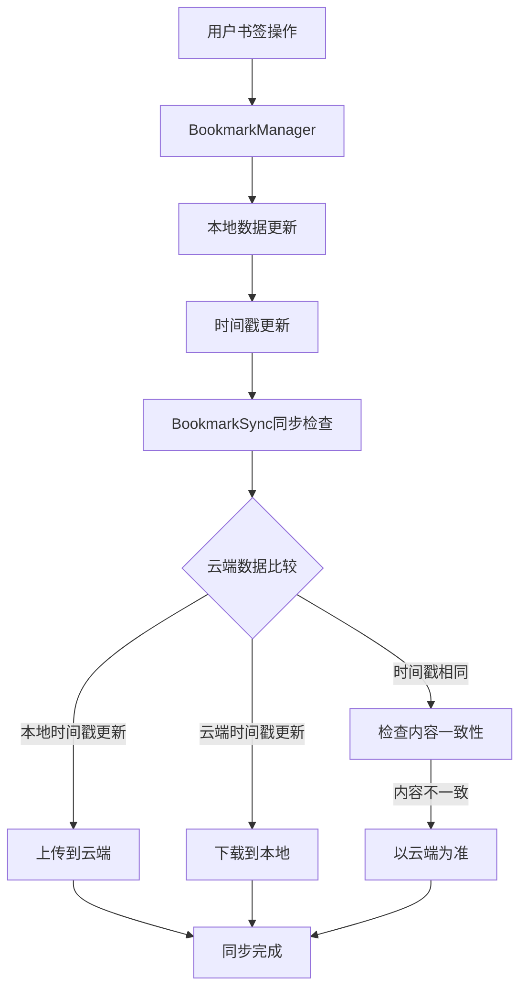

# EcoPaste 云同步架构文档

## 概述

EcoPaste 云同步功能基于 WebDAV 协议实现，采用本地优先的架构设计，支持多设备间的剪贴板数据同步。该架构注重数据安全、冲突解决和用户体验，实现了完整的双向同步、自动同步和配置同步功能。

## 架构原则

### 1. 本地优先 (Local-First)

- 所有操作首先在本地完成，确保快速响应
- 本地数据完整性不依赖网络连接
- 支持离线使用，网络恢复后自动同步

### 2. 渐进式同步

- 支持双开关同步模式（收藏模式、文件模式）
- 智能数据筛选和过滤
- 增量同步减少网络传输

### 3. 数据分离存储

- 元数据与实际文件分离存储
- 统一数据格式 (CloudSyncData)
- 文件包独立管理优化性能

### 4. 智能冲突解决

- 基于校验和的真实冲突检测
- 多策略冲突解决（本地优先、远程优先、智能合并）
- 设备标识和时间戳辅助决策

### 5. 后端自动化

- Rust 插件实现后台定时同步
- 独立的同步状态管理
- 跨平台兼容性

## 核心模块架构

### 1. 前端层 (Frontend Layer)

#### 用户界面组件

- **CloudSync/index.tsx**: 主云同步设置界面
- **ImmediateSyncButton.tsx**: 立即同步按钮组件
- **syncModeConfig.ts**: 同步模式配置组件

#### 状态管理

- **globalStore**: 全局状态管理（Valtio）
  - 同步配置和状态管理
  - WebDAV 配置存储
  - 实时状态更新

### 2. 业务逻辑层 (Business Logic Layer)

#### 同步引擎核心

- **syncEngine.ts**: 同步流程总控制器
  - 完整的双向同步协调 (`performBidirectionalSync`)
  - 冲突检测和解决调度
  - 设备管理和同步状态维护
  - 收藏状态变更检测

#### 数据管理器

- **cloudDataManager.ts**: 云端数据管理

  - 统一格式云端索引管理 (`CloudSyncData`)
  - 云端数据下载和上传
  - 数据格式兼容性处理（新旧格式转换）
  - 云端项目删除和索引更新

- **fileSyncManager.ts**: 文件同步管理

  - 文件上传下载处理
  - 文件元数据管理和路径处理
  - 文件包处理 (`handleFilePackageUploads/Downloads`)
  - 本地缓存和跨设备路径一致性

- **localDataManager.ts**: 本地数据管理
  - 本地数据筛选和过滤 (`filterItemsBySyncMode`)
  - 数据库操作封装
  - 同步结果应用
  - 本地删除策略处理

#### 专用模块

- **bookmarkManager.ts**: 书签管理器

  - 书签分组的本地存储管理
  - 统一时间戳同步机制
  - 跨设备书签智能同步
  - 拖拽排序和持久化
  - 中键删除和右键菜单支持

- **bookmarkSync.ts**: 书签同步管理

  - 书签数据的云端同步逻辑
  - 基于时间戳的冲突解决
  - 新设备识别和数据初始化
  - 设备ID管理和智能合并

- **autoSync.ts**: 自动同步管理（前端）

  - 后端插件状态管理
  - 同步间隔配置
  - 事件监听和状态同步

- **syncConflictResolver.ts**: 冲突解决器

  - 真实冲突检测 (`detectRealConflicts`)
  - 多策略冲突解决（本地优先、远程优先、智能合并）
  - 批量冲突处理

- **configSync.ts**: 配置同步管理
  - 应用配置上传下载
  - 环境相关配置过滤
  - 配置格式兼容处理

### 3. 网络传输层 (Network Layer)

#### WebDAV 前端接口

- **webdav.ts**: WebDAV API 封装
  - 连接管理和认证
  - 文件操作抽象（上传、下载、删除）
  - 连接测试和操作验证
  - 错误处理和结果返回

#### Tauri 后端插件

- **eco-webdav**: Rust WebDAV 实现

  - HTTP 请求优化和流式传输
  - 自动目录创建 (MKCOL)
  - 文件上传下载和二进制处理
  - 连接测试和性能监控

- **eco-auto-sync**: Rust 自动同步插件
  - 后台定时器管理
  - 线程安全的全局状态
  - 事件发射和同步触发
  - 跨平台兼容性

### 4. 数据存储层 (Data Storage Layer)

#### 本地存储

- **SQLite 数据库**: 主数据存储

  - 剪贴板历史记录 (`history` 表)
  - 同步状态和元数据
  - 软删除标识和设备追踪

- **文件系统**: 文件缓存
  - 文件下载缓存目录
  - 配置文件存储
  - 临时文件管理

#### 云端存储

- **WebDAV 服务器**: 云端文件存储
  - `sync-data.json`: 统一数据索引文件
  - `files/`: 原始文件存储目录
  
## 数据流架构

### 主要同步流程



### 自动同步流程



### 文件处理流程


### 书签同步流程



## 关键技术实现

### 1. 统一数据格式

#### SyncItem - 核心同步数据单元

```typescript
interface SyncItem extends BaseClipboardItem {
  count: number; // 使用次数（同步时必需）
  lastModified: number; // 最后修改时间（同步时必需）
  deviceId: string; // 创建设备ID（同步时必需）

  // 同步专用字段
  _syncType?: string; // 同步类型标识
  _originalPath?: string; // 原始路径
  _originalSize?: number; // 原始大小
  _compressedSize?: number; // 压缩后大小
  _originalFiles?: Array<FileMetadata>; // 原始文件信息
  lazyDownload?: boolean; // 按需下载标识
}
```

#### CloudSyncData - 统一云端数据格式

```typescript
interface CloudSyncData {
  format: "unified";
  timestamp: number;
  deviceId: string;
  lastSyncTime: number;
  conflictResolution: "local" | "remote" | "merge" | "prompt";
  networkQuality: "high" | "medium" | "low";
  performanceMetrics: PerformanceMetrics;
  items: SyncItem[]; // 完整的同步数据
  totalItems: number;
  dataChecksum: string;
  deletedItems: string[];
  statistics: DataStatistics;
}
```

### 2. 同步模式配置

#### 双开关模式

EcoPaste 采用简洁的双开关模式来控制同步内容：

```typescript
// 同步模式配置
export interface SyncModeConfig {
  settings: {
    includeText: boolean;   // 文本内容（总是启用）
    includeHtml: boolean;   // HTML 内容（总是启用）
    includeRtf: boolean;    // 富文本内容（总是启用）
    includeImages: boolean; // 图片内容（文件模式开关）
    includeFiles: boolean;  // 文件内容（文件模式开关）
    onlyFavorites: boolean; // 仅同步收藏内容（收藏模式开关）
  };
}

// 默认配置
export const getDefaultSyncModeConfig = (): SyncModeConfig => {
  return {
    settings: {
      includeText: true,    // 总是启用
      includeHtml: true,    // 总是启用
      includeRtf: true,     // 总是启用
      includeImages: false, // 文件模式开关，默认关闭
      includeFiles: false,  // 文件模式开关，默认关闭
      onlyFavorites: false, // 收藏模式开关，默认关闭
    },
  };
};
```

#### 配置说明

**内容类型开关：**

- **文本类内容**（文本、HTML、富文本）：始终启用同步
- **文件类内容**（图片、文件）：通过"文件模式"开关控制
- **收藏模式**：通过"收藏模式"开关控制仅同步收藏内容

| 配置项 | 类型 | 说明 |
|--------|------|------|
| `includeText` | boolean | 文本内容同步（固定启用） |
| `includeHtml` | boolean | HTML 内容同步（固定启用） |
| `includeRtf` | boolean | 富文本内容同步（固定启用） |
| `includeImages` | boolean | 图片内容同步（文件模式开关） |
| `includeFiles` | boolean | 文件内容同步（文件模式开关） |
| `onlyFavorites` | boolean | 仅同步收藏内容（收藏模式开关） |

### 3. 冲突检测和解决

#### 真实冲突检测算法

```typescript
export const detectRealConflicts = (
  localItems: SyncItem[],
  cloudItems: SyncItem[]
): Array<{ localItem: SyncItem; remoteItem: SyncItem }> => {
  const conflicts = [];
  const cloudItemMap = new Map(cloudItems.map((item) => [item.id, item]));

  for (const localItem of localItems) {
    const cloudItem = cloudItemMap.get(localItem.id);
    if (cloudItem) {
      // 基于校验和的内容比较
      const hasChecksumConflict =
        localItem.checksum &&
        cloudItem.checksum &&
        localItem.checksum !== cloudItem.checksum;

      // 收藏状态和备注变更检测
      const hasFavoriteConflict = localItem.favorite !== cloudItem.favorite;
      const hasNoteConflict = (localItem.note || "") !== (cloudItem.note || "");

      if (hasChecksumConflict || hasFavoriteConflict || hasNoteConflict) {
        conflicts.push({ localItem, remoteItem: cloudItem });
      }
    }
  }
  return conflicts;
};
```

#### 智能合并策略

```typescript
function mergeItems(localItem: SyncItem, remoteItem: SyncItem): SyncItem {
  const lastModified = Math.max(
    localItem.lastModified || 0,
    remoteItem.lastModified || 0
  );

  // 合并策略：收藏状态优先本地，备注选择非空较新版本
  const localNote = (localItem.note || "").trim();
  const remoteNote = (remoteItem.note || "").trim();
  const finalNote = localNote || remoteNote;

  return {
    ...localItem, // 优先使用本地版本作为基础
    lastModified, // 使用最新的修改时间
    note: finalNote, // 合并备注
    // 确保其他重要字段不丢失
    search: localItem.search || remoteItem.search,
    checksum: localItem.checksum || remoteItem.checksum,
  };
}
```

### 4. 文件同步优化

#### 文件路径处理

支持多种文件路径格式的智能提取：

- 简单字符串路径
- 文件路径数组
- 复合对象格式（包含 originalPath、path、fileName 等）
- 嵌套路径结构

#### 文件元数据管理

```typescript
interface FileMetadata {
  fileName: string;
  originalPath: string;
  remotePath: string;
  size: number;
  timestamp: number;
  md5?: string; // 文件完整性校验
}
```

#### 跨设备路径一致性

- 智能路径验证和恢复
- 本地缓存策略
- 文件名标准化处理

### 5. WebDAV 协议实现

#### 连接管理和认证

```rust
fn build_auth_header(username: &str, password: &str) -> String {
    let credentials = format!("{}:{}", username, password);
    let encoded = base64::engine::general_purpose::STANDARD.encode(credentials);
    format!("Basic {}", encoded)
}
```

#### 自动目录创建

```rust
async fn ensure_directory_exists_for_path(config: &WebDAVConfig, dir_path: &str) -> Result<()> {
    // 使用 MKCOL 方法递归创建目录
    // 处理已存在目录的冲突
    // 验证目录创建结果
}
```

### 6. 后端自动同步

#### 线程安全的全局状态

```rust
static AUTO_SYNC_STATUS: LazyLock<Arc<Mutex<Option<AutoSyncStatus>>>> =
    LazyLock::new(|| Arc::new(Mutex::new(None)));

static TIMER_HANDLE: LazyLock<Arc<Mutex<Option<thread::JoinHandle<()>>>>> =
    LazyLock::new(|| Arc::new(Mutex::new(None)));
```

#### 定时器管理

- 首次延迟 30 秒执行，确保应用完全启动
- 可配置的同步间隔（1、2、6、12、24 小时）
- 事件驱动的同步触发机制

## 配置和设置

### WebDAV 配置

```typescript
interface WebDAVConfig {
  url: string; // WebDAV 服务器地址
  username: string; // 用户名
  password: string; // 密码
  path: string; // 同步路径
  timeout: number; // 连接超时时间
}
```

### 同步模式配置

```typescript
interface SyncModeConfig {
  settings: {
    includeText: boolean;   // 文本内容（总是启用）
    includeHtml: boolean;   // HTML 内容（总是启用）
    includeRtf: boolean;    // 富文本内容（总是启用）
    includeImages: boolean; // 图片内容（文件模式开关）
    includeFiles: boolean;  // 文件内容（文件模式开关）
    onlyFavorites: boolean; // 仅同步收藏内容（收藏模式开关）
  };
}
```

### 自动同步配置

```typescript
interface AutoSyncConfig {
  enabled: boolean;
  intervalHours: 1 | 2 | 6 | 12 | 24;
}
```

## 安全性考虑

### 1. 数据传输安全

- HTTPS/TLS 加密传输支持
- Base64 编码的基础认证
- 敏感信息不记录日志

### 2. 数据存储安全

- 本地数据库安全存储
- WebDAV 配置独立管理
- 临时文件和缓存清理

### 3. 访问控制

- WebDAV 服务器权限验证
- 文件访问范围限制
- 设备标识和管理

## 性能优化

### 1. 数据传输优化

- 统一数据格式减少冗余
- 增量同步策略
- 文件大小限制和检查

### 2. 本地处理优化

- 数据库索引和查询优化
- 文件缓存策略
- 异步操作和并发控制

### 3. 网络请求优化

- 连接复用和超时管理
- 智能重试机制
- 错误恢复和处理

## 监控和状态管理

### 1. 同步状态监控

```typescript
interface SyncStatus {
  isOnline: boolean;
  isSyncing: boolean;
  lastSyncTime: number;
  pendingCount: number;
  errorCount: number;
  syncProgress: number;
}
```

### 2. 实时状态更新

- Tauri 事件系统
- 前端状态自动更新
- 用户界面实时反馈

### 3. 错误处理和日志

- 分级日志记录
- 详细的错误信息
- 调试和故障排除支持

## 扩展性设计

### 1. 协议扩展

- 插件化传输层设计
- 统一的 API 接口
- 多云服务商支持准备

### 2. 功能扩展

- 数据类型扩展机制
- 自定义同步模式
- 插件化数据处理

### 3. 配置扩展

- 动态配置加载
- 环境特定配置
- 用户自定义选项

## 故障排除

### 常见问题和解决方案

#### 1. 连接问题

- **HTTP 401**: 认证失败，检查用户名密码
- **HTTP 409**: 目录创建冲突，检查路径配置
- **连接超时**: 网络问题或服务器不可达

#### 2. 同步问题

- **冲突循环**: 检查冲突解决策略配置
- **数据不一致**: 验证校验和计算逻辑
- **文件上传失败**: 检查文件大小和权限

#### 3. 性能问题

- **同步缓慢**: 检查网络带宽和数据量
- **内存占用高**: 优化缓存策略和批量处理
- **磁盘空间不足**: 清理临时文件和缓存

### 调试工具

- 详细日志输出
- 网络请求监控
- 数据库状态检查
- 同步状态追踪

---

该架构文档详细描述了 EcoPaste 云同步功能的完整技术实现，包括最新的自动同步、配置同步和统一数据格式等核心功能，为开发、维护和扩展提供了全面的技术参考。
