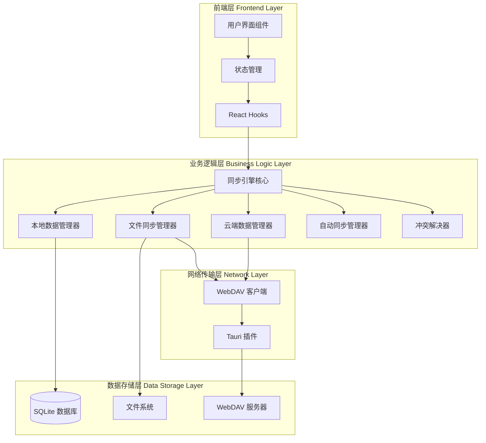
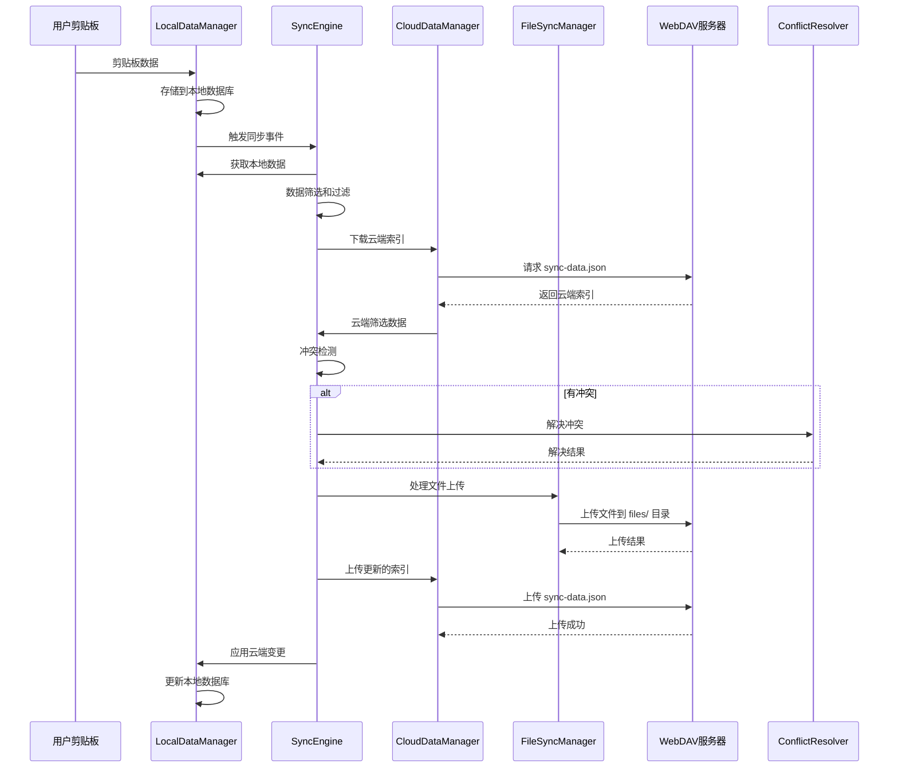
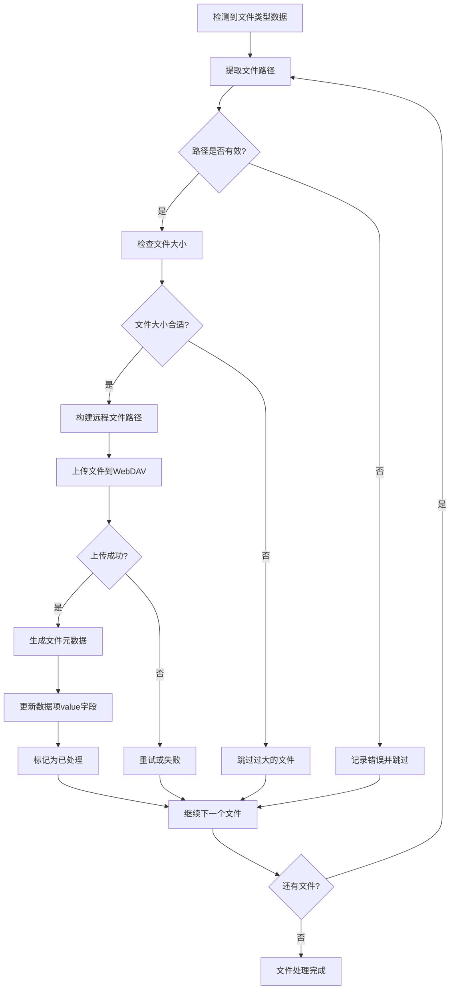
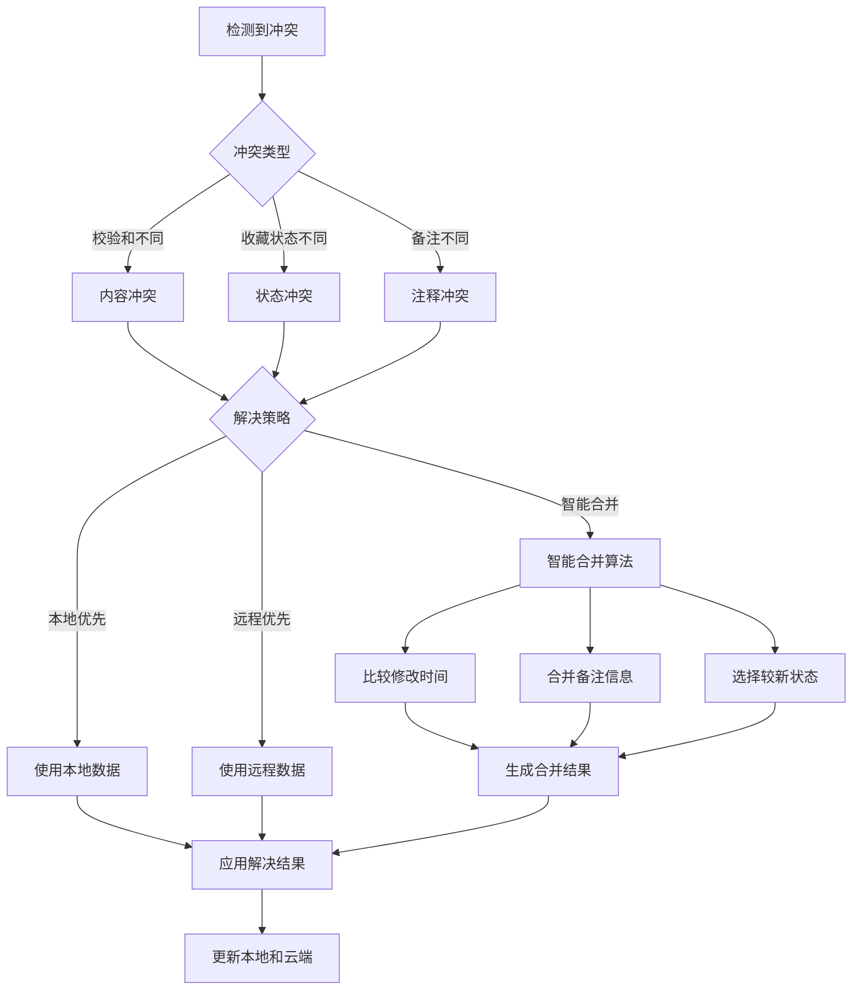
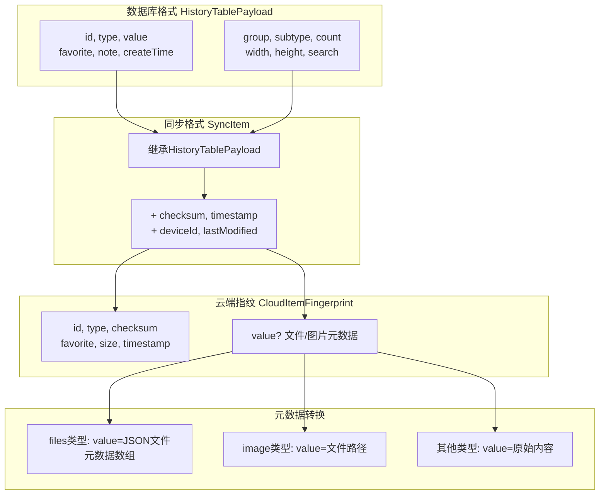
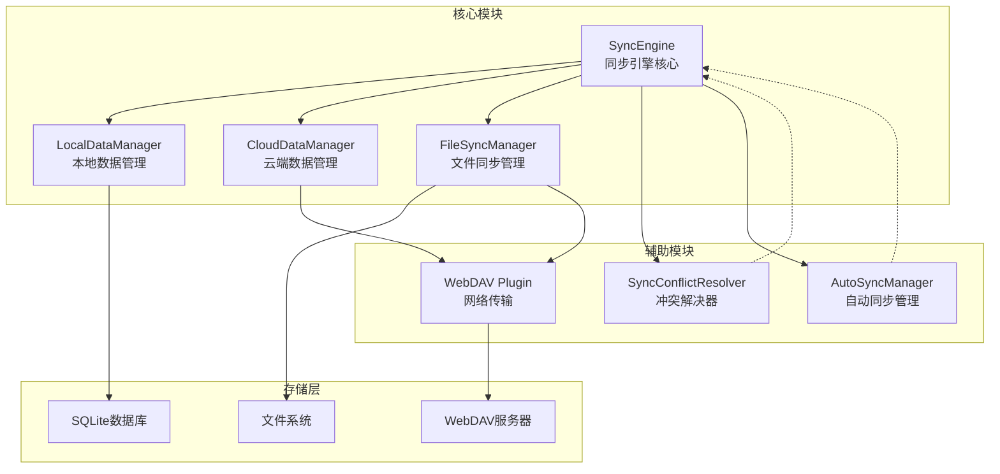

# EcoPaste 云同步架构图

## 系统架构概览



## 同步数据流程



## 文件处理流程



## 冲突解决策略



## WebDAV 云端存储结构

```mermaid
graph LR
    subgraph "WebDAV 服务器"
        A[用户配置的同步路径/]
        B[sync-data.json<br/>数据索引文件]
        C[files/<br/>原始文件目录]

        A --> B
        A --> C

        subgraph "文件目录结构"
            D[itemId_timestamp_filename1.ext]
            E[itemId_timestamp_filename2.ext]
            F[itemId_timestamp_image.png]

            C --> D
            C --> E
            C --> F
        end
    end

    subgraph "sync-data.json 内容"
        G[CloudItemFingerprint[]<br/>轻量级数据指纹]
        H[id, type, checksum<br/>size, timestamp, favorite]
        I[value字段<br/>文件/图片元数据]

        G --> H
        G --> I
    end
```

## 数据转换流程



## 模块依赖关系

