# EcoPaste-Sync 现代架构图

## 系统架构概览

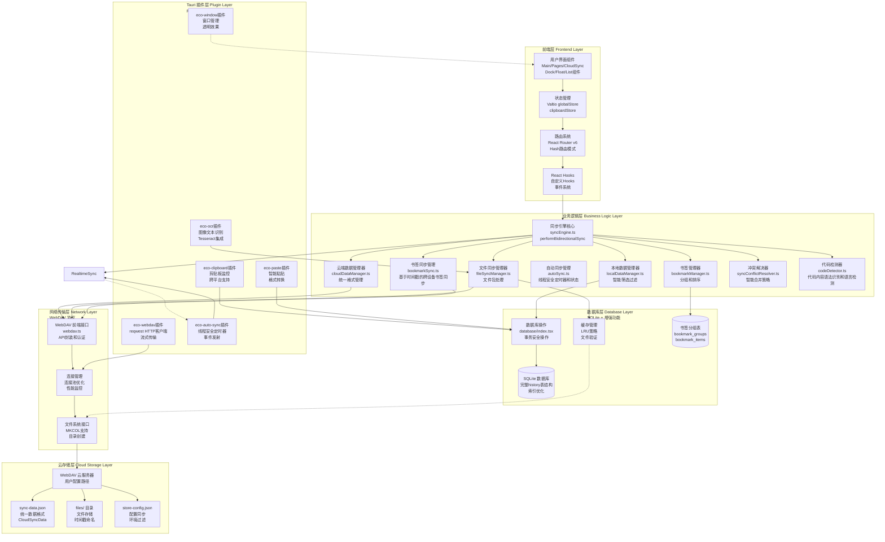

## 主要同步数据流程

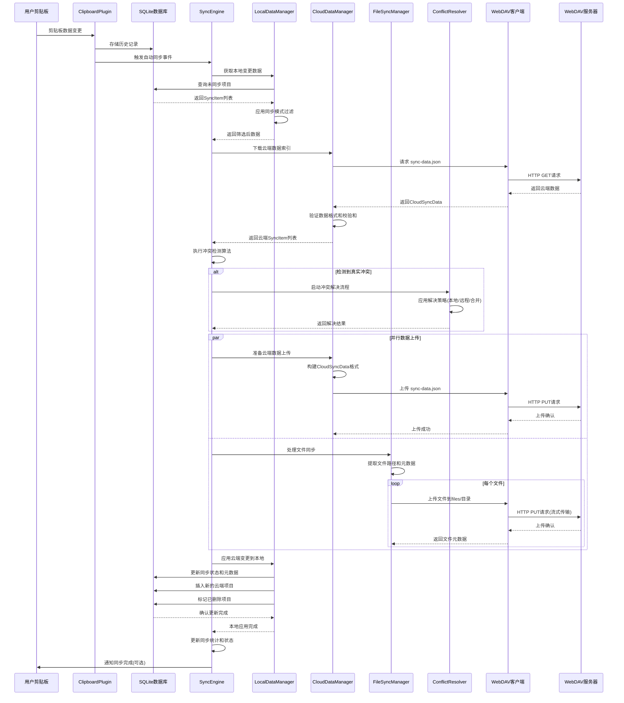

## 自动同步流程

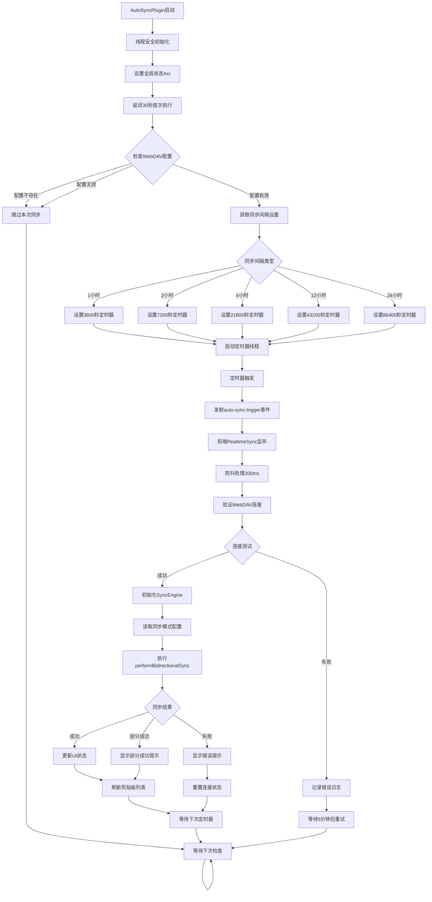

## 文件处理流程

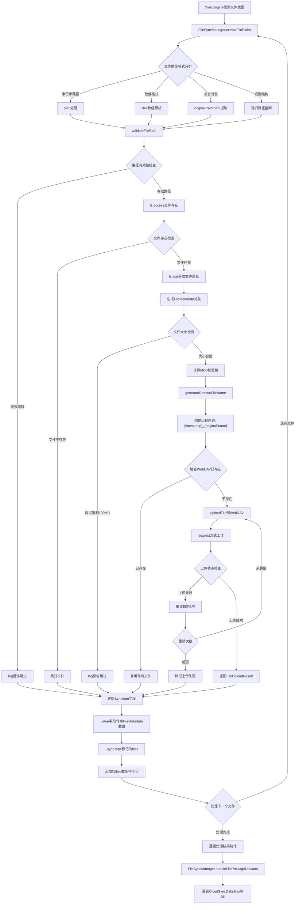

## 冲突解决策略

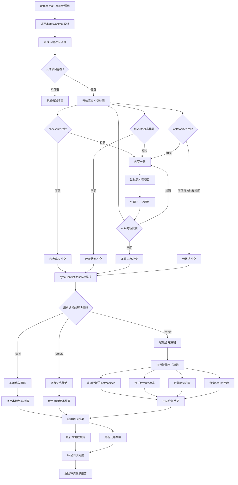

## WebDAV 云端存储结构

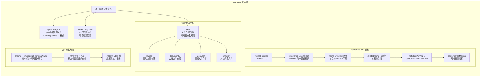

## 数据转换流程

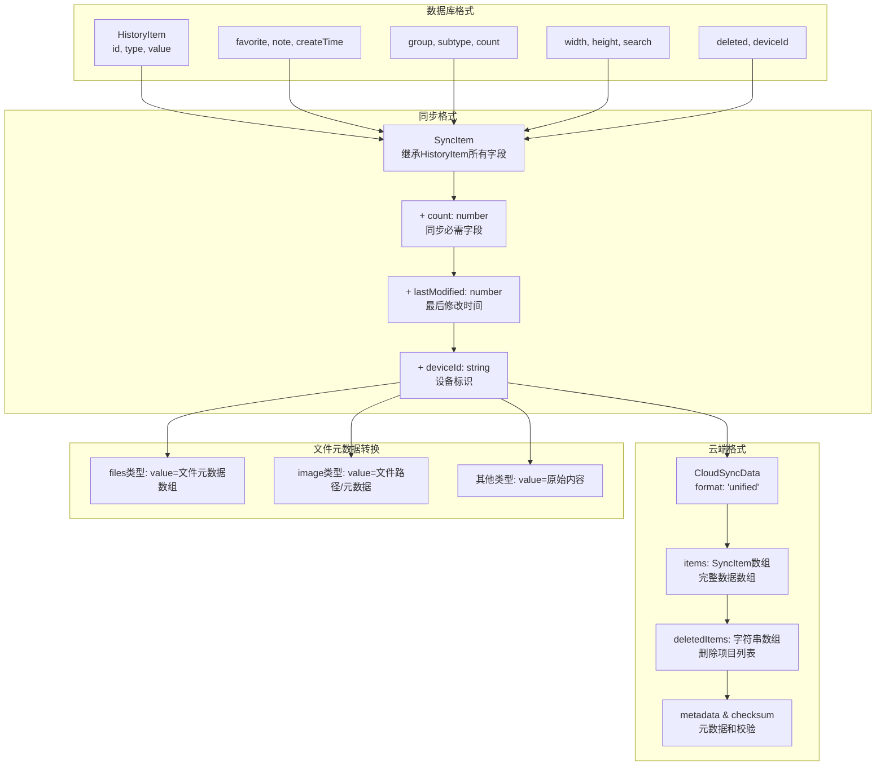

## 模块依赖关系

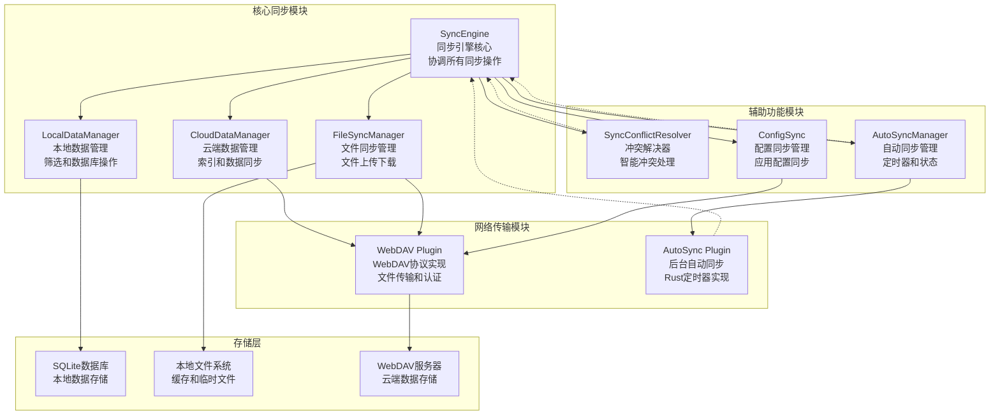

## 书签同步流程

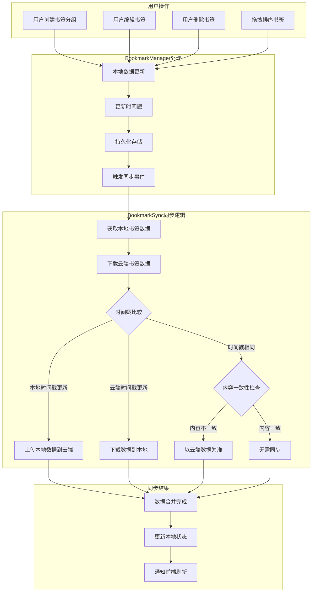

## 配置同步流程

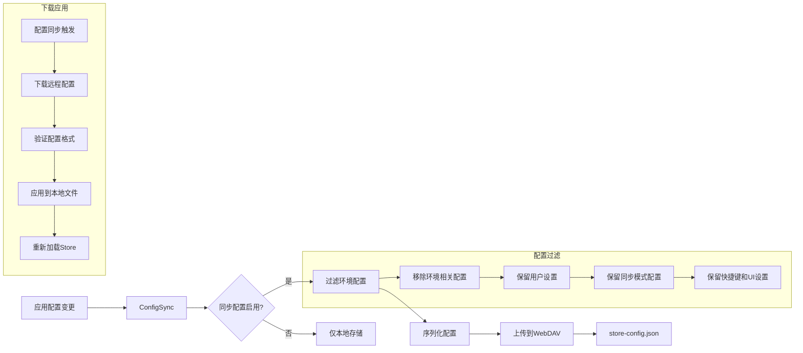

## 后端自动同步架构

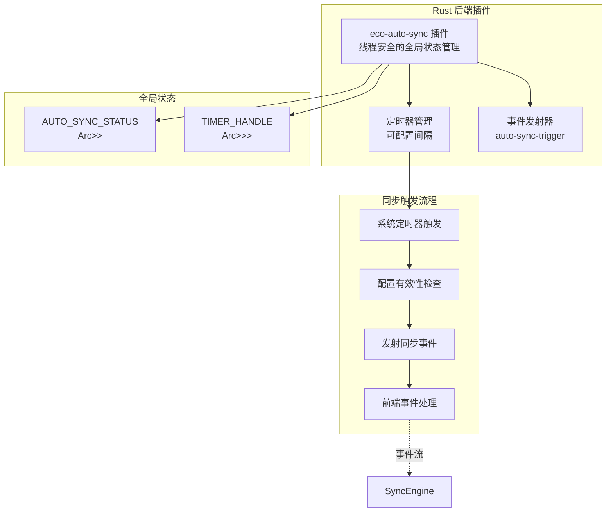

---

该架构图文档详细展示了 EcoPaste 云同步功能的完整架构设计，包括最新的双开关同步模式、自动同步、配置同步和统一数据格式等核心组件，为理解和维护系统提供了可视化的技术参考。