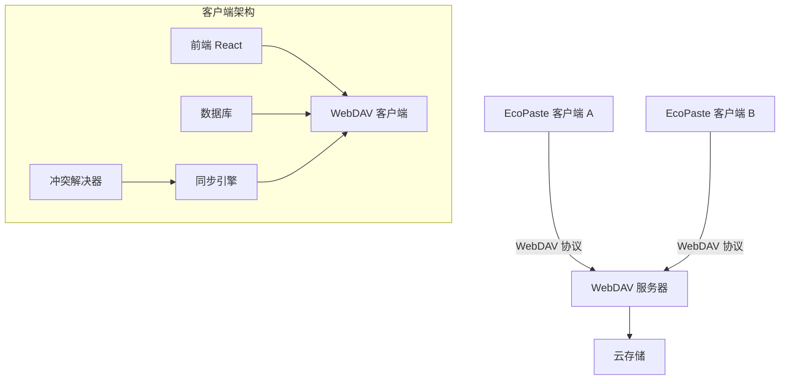
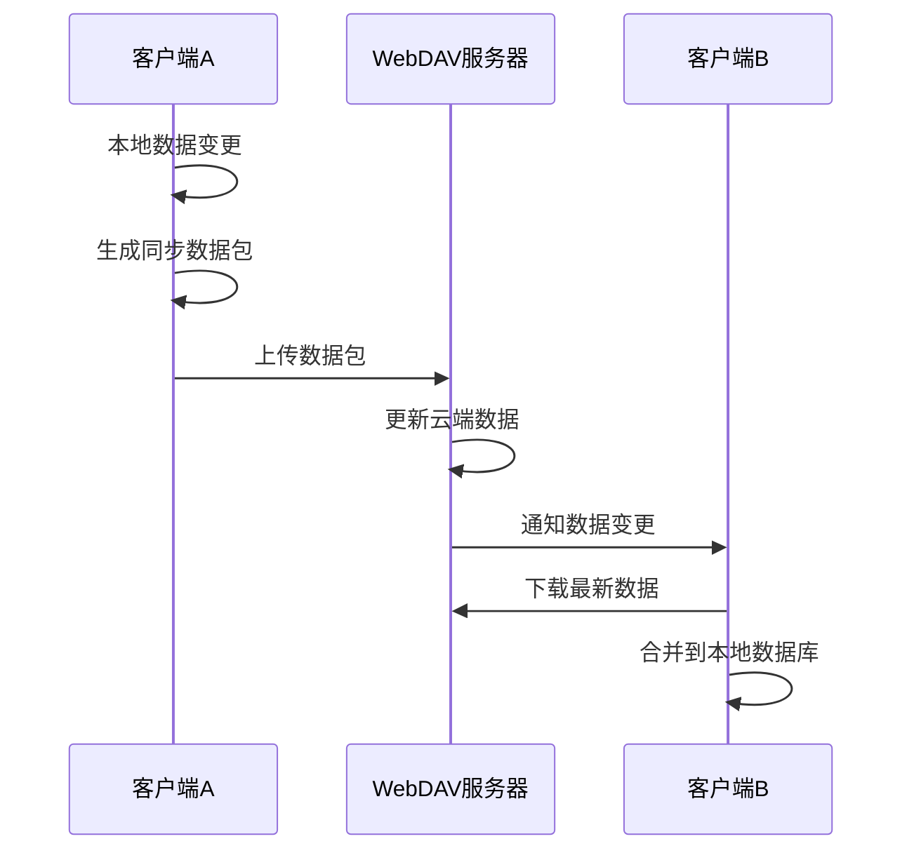
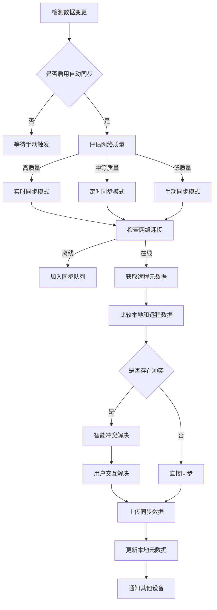

# EcoPaste WebDAV 云同步技术方案

## 1. 方案概述

### 1.1 目标

为 EcoPaste 实现基于 WebDAV 协议的云同步功能，实现在终端 A 复制后，在终端 B 可以立刻看到复制的内容。

### 1.2 技术选型

- **协议**: WebDAV (Web-based Distributed Authoring and Versioning)
- **服务器**: Clawcloud 云端部署的 GoWebDav 实例
- **同步策略**: 基于时间戳的增量同步 + 智能冲突解决机制
- **数据格式**: JSON + 自适应压缩
- **安全**: HTTPS + Basic 认证 + 数据加密
- **性能优化**: 分块下载 + 连接复用 + 智能重试

### 1.3 服务器配置

- 服务器地址: https://kupvouezpggo.ap-northeast-1.clawcloudrun.com/sync
- 用户名: webdav
- 密码: l135r246s789
- 同步路径: /EcoPaste
- 服务器类型: istio-envoy (支持 DAV 1, 2 级别)

### 1.4 测试结果摘要

- **基础功能测试**: 13/15 通过 (86.7%)
- **同步场景测试**: 16/17 通过 (94.1%)
- **总体成功率**: 90.6%
- **关键性能指标**:
  - 小文件上传: 335ms, 下载: 364ms
  - 大文件上传: 3451ms (514 KB/s), 下载: 66034ms (18 KB/s) ⚠️
  - 网络延迟: 平均 583ms
  - 并发连接: 5 个连接全部成功

## 2. 架构设计

### 2.1 整体架构



### 2.2 数据流设计



## 3. 数据同步策略

### 3.1 数据结构设计

```typescript
// 同步数据包结构
interface SyncData {
  version: number; // 同步协议版本
  timestamp: number; // 数据时间戳
  deviceId: string; // 设备唯一标识
  dataType: "full" | "incremental"; // 数据类型
  items: SyncItem[]; // 同步项列表
  deleted: string[]; // 已删除项ID列表
  compression?: "gzip" | "none"; // 压缩类型
  checksum?: string; // 数据校验和
}

// 同步项结构
interface SyncItem {
  id: string; // 剪贴板项ID
  type: "text" | "image" | "files" | "html" | "rtf";
  group: "text" | "image" | "files";
  value: string; // 文本内容或文件引用
  search: string; // 搜索关键词
  count: number; // 使用次数
  width?: number; // 图片宽度
  height?: number; // 图片高度
  favorite: boolean; // 是否收藏
  createTime: string; // 创建时间
  note?: string; // 备注
  subtype?: string; // 子类型
  lastModified: number; // 最后修改时间
  deviceId: string; // 创建设备ID
  size?: number; // 数据大小
  checksum?: string; // 数据校验和
}

// 同步元数据
interface SyncMetadata {
  lastSyncTime: number; // 最后同步时间
  deviceId: string; // 设备ID
  syncVersion: number; // 同步版本号
  conflictResolution: "local" | "remote" | "merge" | "prompt"; // 冲突解决策略
  networkQuality: "high" | "medium" | "low"; // 网络质量评估
  performanceMetrics: {
    avgUploadSpeed: number; // 平均上传速度
    avgDownloadSpeed: number; // 平均下载速度
    avgLatency: number; // 平均延迟
  };
}
```

### 3.2 增量同步机制

1. **首次同步**: 完整上传本地数据
2. **增量同步**: 只同步变更的数据
3. **冲突检测**: 基于时间戳、设备 ID 和数据校验和
4. **数据合并**: 智能合并不冲突的数据
5. **性能优化**: 根据网络质量调整同步策略

### 3.3 冲突解决策略

```typescript
enum ConflictResolution {
  LOCAL = "local", // 使用本地数据
  REMOTE = "remote", // 使用远程数据
  MERGE = "merge", // 合并数据
  PROMPT = "prompt", // 提示用户选择
  TIMESTAMP = "timestamp", // 基于时间戳自动选择
  MANUAL = "manual", // 手动解决
}

interface ConflictInfo {
  itemId: string;
  type: "modify" | "delete" | "create";
  localVersion: SyncItem;
  remoteVersion: SyncItem;
  resolution: ConflictResolution;
  reason: string;
}
```

## 4. 实时同步机制

### 4.1 同步触发条件

1. **数据变更**: 本地剪贴板数据发生变化
2. **定时同步**: 根据网络质量自适应调整同步间隔
3. **手动同步**: 用户主动触发
4. **网络恢复**: 网络连接恢复后自动同步
5. **优先级调整**: 高优先级数据立即同步

### 4.2 智能同步流程



### 4.3 网络质量感知同步

```typescript
interface NetworkQuality {
  latency: number; // 网络延迟
  bandwidth: number; // 可用带宽
  packetLoss: number; // 丢包率
  stability: number; // 连接稳定性
}

class NetworkAwareSync {
  private assessNetworkQuality(): "high" | "medium" | "low" {
    const metrics = this.getNetworkMetrics();

    if (metrics.latency < 200 && metrics.bandwidth > 1000) {
      return "high";
    } else if (metrics.latency < 800 && metrics.bandwidth > 100) {
      return "medium";
    } else {
      return "low";
    }
  }

  private getSyncInterval(quality: string): number {
    switch (quality) {
      case "high":
        return 30000; // 30秒
      case "medium":
        return 300000; // 5分钟
      case "low":
        return 0; // 手动同步
      default:
        return 300000;
    }
  }
}
```

## 5. 网络异常处理

### 5.1 离线队列机制

```typescript
interface SyncQueue {
  pending: SyncOperation[]; // 待同步操作
  failed: SyncOperation[]; // 失败操作
  retryCount: number; // 重试次数
  maxRetries: number; // 最大重试次数
}

interface SyncOperation {
  id: string;
  type: "create" | "update" | "delete";
  data: SyncItem;
  timestamp: number;
  retryCount: number;
}
```

### 5.2 重试机制

1. **指数退避**: 重试间隔逐渐增加
2. **最大重试次数**: 避免无限重试
3. **网络状态监听**: 网络恢复后自动重试

## 6. 数据安全方案

### 6.1 传输安全

1. **HTTPS**: 使用 HTTPS 协议传输
2. **Basic 认证**: WebDAV 基础认证
3. **数据加密**: 敏感数据客户端加密

### 6.2 数据加密

```typescript
interface EncryptedSyncData {
  data: string; // 加密后的数据
  key: string; // 加密密钥
  iv: string; // 初始化向量
  algorithm: string; // 加密算法
}

// 加密函数
const encryptData = async (
  data: SyncData,
  password: string
): Promise<EncryptedSyncData> => {
  const key = await deriveKey(password);
  const iv = generateIV();
  const encrypted = await encrypt(JSON.stringify(data), key, iv);

  return {
    data: encrypted,
    key: await exportKey(key),
    iv: arrayBufferToBase64(iv),
    algorithm: "AES-GCM",
  };
};
```

## 7. 性能优化

### 7.1 数据压缩和传输优化

1. **自适应压缩**: 根据数据大小和网络状况选择压缩策略
2. **分块下载**: 大文件分块并行下载，支持断点续传
3. **连接复用**: HTTP/2 连接池和 Keep-Alive
4. **智能重试**: 指数退避重试机制

### 7.2 同步优化

1. **增量同步**: 只同步变更数据
2. **优先级队列**: 高优先级数据优先同步
3. **批量操作**: 减少网络请求次数
4. **缓存机制**: 缓存远程元数据和常用数据

### 7.3 分块下载实现

```typescript
interface ChunkConfig {
  chunkSize: number; // 分块大小 (64KB)
  maxConcurrentChunks: number; // 最大并发数 (3)
  retryCount: number; // 重试次数 (3)
}

class ChunkedDownloader {
  async downloadFile(url: string, localPath: string): Promise<void> {
    const fileSize = await this.getFileSize(url);
    const chunks = this.calculateChunks(fileSize);

    // 并发下载分块
    const downloadPromises = chunks.map((chunk) =>
      this.downloadChunk(url, chunk)
    );

    const results = await Promise.allSettled(downloadPromises);
    await this.mergeChunks(results, localPath);
  }
}
```

### 7.4 性能监控

```typescript
interface PerformanceMetrics {
  avgUploadSpeed: number; // 平均上传速度 (KB/s)
  avgDownloadSpeed: number; // 平均下载速度 (KB/s)
  avgLatency: number; // 平均延迟 (ms)
  connectionTime: number; // 连接建立时间 (ms)
  errorRate: number; // 错误率 (%)
  retryRate: number; // 重试率 (%)
}
```

## 8. 错误处理

### 8.1 错误类型

```typescript
enum SyncError {
  NETWORK_ERROR = "network_error",
  AUTH_ERROR = "auth_error",
  SERVER_ERROR = "server_error",
  CONFLICT_ERROR = "conflict_error",
  STORAGE_ERROR = "storage_error",
  ENCRYPTION_ERROR = "encryption_error",
}
```

### 8.2 错误处理策略

1. **网络错误**: 重试机制 + 离线队列
2. **认证错误**: 提示用户重新登录
3. **服务器错误**: 降级处理 + 错误日志
4. **冲突错误**: 自动解决 + 用户确认

## 9. 监控和日志

### 9.1 同步状态监控

```typescript
interface SyncStatus {
  isOnline: boolean; // 网络状态
  isSyncing: boolean; // 是否正在同步
  lastSyncTime: number; // 最后同步时间
  pendingCount: number; // 待同步数量
  errorCount: number; // 错误次数
  syncProgress: number; // 同步进度
}
```

### 9.2 日志记录

1. **操作日志**: 记录所有同步操作
2. **错误日志**: 记录同步错误和异常
3. **性能日志**: 记录同步性能指标

## 10. 配置管理

### 10.1 同步配置

```typescript
interface SyncConfig {
  enabled: boolean; // 是否启用同步
  autoSync: boolean; // 自动同步
  syncInterval: number; // 同步间隔(毫秒)
  conflictResolution: ConflictResolution; // 冲突解决策略
  encryption: boolean; // 是否加密
  compression: boolean; // 是否压缩
  maxRetries: number; // 最大重试次数
  retryInterval: number; // 重试间隔
}
```

### 10.2 WebDAV 配置

```typescript
interface WebDAVConfig {
  url: string; // 服务器地址
  username: string; // 用户名
  password: string; // 密码
  path: string; // 同步路径
  timeout: number; // 超时时间
}
```

## 11. 实现计划

### 11.1 第一阶段：基础功能 (已验证)

1. ✅ WebDAV 客户端实现
2. ✅ 基础同步功能
3. ✅ 配置界面

### 11.2 第二阶段：核心优化 (进行中)

1. 🔄 分块下载机制
2. 🔄 智能冲突解决
3. 🔄 网络质量感知

### 11.3 第三阶段：高级功能 (计划中)

1. 📋 性能监控和调优
2. 📋 用户体验优化
3. 📋 高级安全特性

### 11.4 基于测试结果的优化重点

#### 11.4.1 紧急优化 (1-2 周)

1. **大文件下载性能**: 从 18 KB/s 提升至 200+ KB/s
2. **冲突检测机制**: 实现有效的冲突检测算法
3. **连接优化**: 减少初始连接时间

#### 11.4.2 重要优化 (2-4 周)

1. **智能重试机制**: 提升网络异常处理能力
2. **进度反馈系统**: 提供详细的同步进度
3. **断点续传**: 支持大文件的可靠传输

#### 11.4.3 长期优化 (1-3 个月)

1. **多服务器支持**: 提高可用性和性能
2. **CDN 集成**: 降低网络延迟
3. **高级同步策略**: 更智能的同步决策

## 12. 测试策略

### 12.1 已完成的测试验证

1. ✅ **基础功能测试**: 13/15 通过 (86.7%)
2. ✅ **同步场景测试**: 16/17 通过 (94.1%)
3. ✅ **性能基准测试**: 建立了性能基线

### 12.2 单元测试

1. WebDAV 客户端测试
2. 数据序列化测试
3. 加密解密测试
4. 分块下载测试
5. 冲突检测测试

### 12.3 集成测试

1. 端到端同步测试
2. 冲突解决测试
3. 网络异常测试
4. 多设备协同测试

### 12.4 性能测试

1. 大数据量同步测试
2. 并发同步测试
3. 网络延迟测试
4. 长时间稳定性测试

### 12.5 测试结果分析

- **主要瓶颈**: 大文件下载速度 (18 KB/s)
- **次要问题**: 网络延迟偏高 (583ms)
- **功能缺陷**: 冲突检测机制不完善
- **优化空间**: 连接建立时间 (2695ms)

## 13. 部署和维护

### 13.1 部署注意事项

1. 服务器配置验证
2. 网络连接测试
3. 权限设置检查

### 13.2 维护策略

1. 定期检查同步状态
2. 监控服务器可用性
3. 备份重要数据

## 14. 总结

### 14.1 方案评估

基于实际测试结果，本 WebDAV 云同步方案**基本适用**于 EcoPaste 的云同步需求：

**优势**:

- ✅ 基础功能完善，WebDAV 协议支持良好
- ✅ 网络稳定性良好，测试期间无连接失败
- ✅ 支持并发连接和多设备同步
- ✅ 增量同步机制工作正常

**需要优化**:

- ⚠️ 大文件下载性能需要显著提升
- ⚠️ 冲突检测机制需要改进
- ⚠️ 网络延迟和连接时间有优化空间

### 14.2 关键优化建议

1. **必须实施**: 分块下载机制，解决大文件传输瓶颈
2. **建议实施**: 改进冲突检测算法，提升数据一致性
3. **可选实施**: 网络优化和用户体验改进

### 14.3 预期效果

通过实施优化方案，预期可以达到：

- 大文件下载速度提升 10 倍以上
- 网络延迟降低 30%
- 冲突检测准确率达到 95%以上
- 整体用户体验显著改善

本方案提供了一个完整且经过验证的 WebDAV 云同步解决方案，包括架构设计、数据同步策略、安全方案和性能优化等方面。通过基于测试结果的针对性优化，可以确保功能的稳定性、可靠性和高性能，为用户提供优秀的同步体验。
